# Fitting a model to data

## Introducing likelihood functions

In Gadget, a likelihood function is specified by supplying likelihood components within the likelihood
file, which is referred to by the main file. Individual likelihood component scores are summed together 
after being multiplied by weights to form a total likelihood score, and each likelihood score is defined by the type of likelihood component specified. 
Component types define both the kind of data and likelihood function being calculated for that component.
Although we refer to 'likelihood scores' throughout this description, it should be kept in mind that these
are more accurately sums of log likelihoods, so that the objective function used for model fitting attempts to minimize the total likelihood score.


## Incorporating data (Ling case study cont.)
In introducing likelihood components, we will first go through those used within the ling example
in detail, but only mention the other types as they follow similar patterns of implementation. 
To use Rgadget to set up likelihood files, the first consideration that should be made is what 
data are available that would be useful for creating a likelihood component. These have been 
provided for you here: in the 'data_provided' folder, you will find catch data (as introduced 
with the fleets), as well as survey indices, catch distribution, and 'stock' distribution data. 
Catch distributions include numbers at length as well as numbers at age and length by fleet. 
These therefore include both biological samples in fishery data as well as survey data. 
Each length- or age-bin has been defined as having the lower bound only inclusive, except that 
the lower bound of the smallest bin and the upper bound of the largest bin are open-ended to 
include all values lower or higher, respectively. These numbers are then used within Gadget 
to form proportions among defined bins, which are compared to the same proportions among the 
same bins simulated in the model. Stock distribution data are numbers within each stock, which 
for ling is immature or mature, but could for example be gender-specific stocks. Stock distribution 
numbers are similarly used to form proportions within Gadget.

As we saw when incorporating catch data into fleet files (day 2), certain attributes need to 
be present in order for the proper and internally consistent Gadget aggregation files to be
created alongside these data files. For catch and stock distribution data, these include area,
length, and age aggregations. Even when there is only a single bin, these aggregations need 
to be specified. For example a single area and a single age group is needed for length 
distributions, in addition to the length bins. Note that bins need not be evenly distributed
across the total length range; instead they are highly flexible and can be specified as any
grouping. Therefore the user should be careful to ensure that the definitions make sense and 
that bins do not overlap. In our example below, we show how to add those necessary attributes,
although in reality to do this we also use another R package named 'mfdb' that is aimed at 
database management and data extraction [more on this in day 5]. 


```r
library(tidyverse)
library(Rgadget)

#assuming you are beginning in a fresh session; this information should be in an 
#initialization script

base_dir <- 'ling_model'
vers <- c('01-base')
gd <- normalizePath(gadget.variant.dir(sprintf(paste0("%s/",vers),base_dir)))

ling.imm <- gadgetstock('lingimm',gd)
ling.mat <- gadgetstock('lingmat',gd)
area_file <- read.gadget.file(gd, 'Modelfiles/area')

minage <- ling.imm[[1]]$minage
maxage <- ling.mat[[1]]$maxage
maxlength <- ling.mat[[1]]$maxlength 
minlength <- ling.imm[[1]]$minlength
dl <- ling.imm[[1]]$dl


create_intervals <-  function (prefix, vect) {
  
  x<-
    structure(vect[1:(length(vect)-1)], names = paste0(prefix, vect[1:(length(vect)-1)])) %>% 
    as.list(.) %>% 
    purrr::map(~structure(seq(.,vect[-1][which(vect[1:(length(vect)-1)]==.)],1)[-length(seq(.,vect[-1][which(vect[1:(length(vect)-1)]==.)],1))], 
                          min = ., 
                          max = vect[-1][which(vect[1:(length(vect)-1)]==.)]))
  
  x[[length(x)]] <- c(x[[length(x)]], attributes(x[[length(x)]])$max) %>% 
    structure(., 
              min = min(.), 
              max = max(.))
  
  
  return(x)
}
#just to see what this function does:
create_intervals('len',seq(minlength, maxlength, dl)) %>% .[1:3]
```

```
## $len20
## [1] 20 21 22 23
## attr(,"min")
## [1] 20
## attr(,"max")
## [1] 24
## 
## $len24
## [1] 24 25 26 27
## attr(,"min")
## [1] 24
## attr(,"max")
## [1] 28
## 
## $len28
## [1] 28 29 30 31
## attr(,"min")
## [1] 28
## attr(,"max")
## [1] 32
```


```r
#catch distribution data available:
#length distributions do not regard age bins
ldist.surv <- structure(read_csv('data_provided/ldist_sur.csv'),
                        area = list(area_file[[1]]$areas) %>% set_names(.),
                        length = create_intervals('len',seq(minlength, maxlength, dl)),
                        age = create_intervals('all',seq(minage, maxage, maxage-minage))
)
ldist.lln <- structure(read_csv('data_provided/ldist_lln.csv'),
                       area = list(area_file[[1]]$areas) %>% set_names(.),
                       length = create_intervals('len',seq(minlength, maxlength, dl)),
                       age = create_intervals('all',seq(minage, maxage, maxage-minage))
)
ldist.bmt <- structure(read_csv('data_provided/ldist_bmt.csv'),
                       area = list(area_file[[1]]$areas) %>% set_names(.),
                       length = create_intervals('len',seq(minlength, maxlength, dl)),
                       age = create_intervals('all',seq(minage, maxage, maxage-minage))
)
ldist.gil <- structure(read_csv('data_provided/ldist_gil.csv'),
                       area = list(area_file[[1]]$areas) %>% set_names(.),
                       length = create_intervals('len',seq(minlength, maxlength, dl)),
                       age = create_intervals('all',seq(minage, maxage, maxage-minage))
)

attributes(ldist.surv) %>% 
  purrr::map(head)
```

```
## $names
## [1] "year"   "step"   "area"   "age"    "length" "number"
## 
## $class
## [1] "spec_tbl_df" "tbl_df"      "tbl"         "data.frame" 
## 
## $row.names
## [1] 1 2 3 4 5 6
## 
## $spec
## $spec$cols
## $spec$cols$year
## <collector_double>
## 
## $spec$cols$step
## <collector_double>
## 
## $spec$cols$area
## <collector_double>
## 
## $spec$cols$age
## <collector_character>
## 
## $spec$cols$length
## <collector_character>
## 
## $spec$cols$number
## <collector_double>
## 
## 
## $spec$default
## <collector_guess>
## 
## $spec$skip
## [1] 1
## 
## 
## $area
## $area$`1`
## [1] 1
## 
## 
## $length
## $length$len20
## [1] 20 21 22 23
## attr(,"min")
## [1] 20
## attr(,"max")
## [1] 24
## 
## $length$len24
## [1] 24 25 26 27
## attr(,"min")
## [1] 24
## attr(,"max")
## [1] 28
## 
## $length$len28
## [1] 28 29 30 31
## attr(,"min")
## [1] 28
## attr(,"max")
## [1] 32
## 
## $length$len32
## [1] 32 33 34 35
## attr(,"min")
## [1] 32
## attr(,"max")
## [1] 36
## 
## $length$len36
## [1] 36 37 38 39
## attr(,"min")
## [1] 36
## attr(,"max")
## [1] 40
## 
## $length$len40
## [1] 40 41 42 43
## attr(,"min")
## [1] 40
## attr(,"max")
## [1] 44
## 
## 
## $age
## $age$all3
##  [1]  3  4  5  6  7  8  9 10 11 12 13 14 15
## attr(,"min")
## [1] 3
## attr(,"max")
## [1] 15
```


```r
#age bins needed for age-length distributions
aldist.surv <- structure(read_csv('data_provided/aldist_sur.csv'),
                         area = list(area_file[[1]]$areas) %>% set_names(.),
                         length = create_intervals('len',seq(minlength, maxlength, dl)),
                         age = create_intervals('age',c(minage:11, maxage))
)
aldist.lln <- structure(read_csv('data_provided/aldist_lln.csv'),
                        area = list(area_file[[1]]$areas) %>% set_names(.),
                        length = create_intervals('len',seq(minlength, maxlength, dl)),
                        age = create_intervals('age',c(minage:11, maxage))
)
aldist.bmt <- structure(read_csv('data_provided/aldist_bmt.csv'),
                        area = list(area_file[[1]]$areas) %>% set_names(.),
                        length = create_intervals('len',seq(minlength, maxlength, dl)),
                        age = create_intervals('age',c(minage:11, maxage))
)
aldist.gil <- structure(read_csv('data_provided/aldist_gil.csv'),
                        area = list(area_file[[1]]$areas) %>% set_names(.),
                        length = create_intervals('len',seq(minlength, maxlength, dl)),
                        age = create_intervals('age',c(minage:11, maxage))
)

attributes(aldist.surv)$age %>% head(3)
```

```
## $age3
## [1] 3
## attr(,"min")
## [1] 3
## attr(,"max")
## [1] 4
## 
## $age4
## [1] 4
## attr(,"min")
## [1] 4
## attr(,"max")
## [1] 5
## 
## $age5
## [1] 5
## attr(,"min")
## [1] 5
## attr(,"max")
## [1] 6
```


```r
#stock distribution data available:
matp.surv <- structure(read_csv('data_provided/matp_sur.csv'),
                       area = list(area_file[[1]]$areas) %>% set_names(.),
                       length = create_intervals('len',seq(minlength, maxlength, dl*2)),
                       age = list(mat_ages = ling.mat[[1]]$minage:ling.mat[[1]]$maxage)
)

#attributes(matp.surv)
```

For ling, length-based indices were used by choosing 7 'slices' of abundance indices across the
length range of ling observed. Index bounds are defined as above, generally inclusive of the 
lower bound only, but open-ended for the smallest and largest bins. It is important to note 
that only area and length attributes are included as attributes on these data frames, rather than
age, as in the distributional components. The length attribute allows `gadget_update` to recognize
these data as length-based indices, rather than age-based or acoustic indices, for example. It is
also important to keep in mind
here that each slice will have its own estimated catchability per survey (single data frame below)
and area combination (multiple areas may be within a data frame). 


```r
#survey index data available: 
slices <- 
  list('len20' = c(20,52), 'len52' = c(52,60), 'len60' = c(60,72), 
       'len72' = c(72,80), 'len80' = c(80,92), 'len92' = c(92,100), 
       'len100' = c(100,160) )

# just to illustrate slices:

ldist.surv %>% 
  mutate(length = substring(length, 4) %>% as.numeric) %>% 
  filter(year %in% c(2000,2005,2010,2015)) %>% 
  group_by(year,length) %>% 
  summarise(n = sum(number)) %>% 
  ggplot(aes(x = length, y = n)) + geom_line() + 
  geom_vline(aes(xintercept = length), 
             lty = 2, col = 'orange', 
             data = slices %>% 
               bind_rows() %>% 
               t() %>% .[-1,1] %>% 
               tibble(length = .)) + 
  facet_wrap(~year)
```

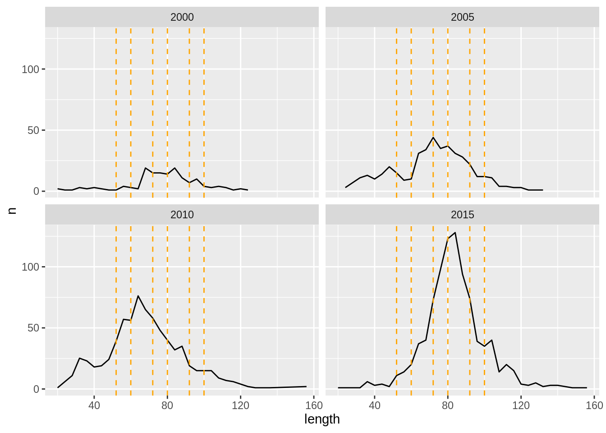


```r
# set up aggregation info for length-based survey indices
SI1 <- structure(read_csv('data_provided/SI1.csv'),
                 area = list(area_file[[1]]$areas) %>% set_names(.),
                 length = create_intervals('len', slices[[1]]))
SI2 <- structure(read_csv('data_provided/SI2.csv'),
                 area = list(area_file[[1]]$areas) %>% set_names(.),
                 length = create_intervals('len', slices[[2]]))
SI3 <- structure(read_csv('data_provided/SI3.csv'),
                 area = list(area_file[[1]]$areas) %>% set_names(.),
                 length = create_intervals('len', slices[[3]]))
SI4 <- structure(read_csv('data_provided/SI4.csv'),
                 area = list(area_file[[1]]$areas) %>% set_names(.),
                 length = create_intervals('len', slices[[4]]))
SI5 <- structure(read_csv('data_provided/SI5.csv'),
                 area = list(area_file[[1]]$areas) %>% set_names(.),
                 length = create_intervals('len', slices[[5]]))
SI6 <- structure(read_csv('data_provided/SI6.csv'),
                 area = list(area_file[[1]]$areas) %>% set_names(.),
                 length = create_intervals('len', slices[[6]]))
SI7 <- structure(read_csv('data_provided/SI7.csv'),
                 area = list(area_file[[1]]$areas) %>% set_names(.),
                 length = create_intervals('len', slices[[7]]))
```

### Exercise

* Change the aggregation levels of the age-length distribution data so that data are compared to model results within the bins 3 - 6, 7, 8, 9, 10 - 11, and 12 - 15.


## Setting up likelihood components
Using Rgadget, writing the files that specify the likelihood componenets is straightforward. 
When calling `gadgetlikelihood` and then writing it with `write.gadget.file`, a likelihood file
is created within R and written to disc.  The likelihood file contains a list of likelihood 
component specifications, and within each component is where the likelihood function, data, and
weighting of the likelihood component is specified.

Here we start with the distributional components. In all cases, each component receives a distinct 
name (to be referenced later so keep them short and distinct), weights (1 to yield equal weights 
for now), data as imported above, and the fleet names and stock names to which these data apply. 
As a default, Rgadget specifies a sum of squares function to calculate the likelihood score
(`sumofsquares`), although a variety of other functions are possible, including one for stratified 
sum of squares (`stratified`), multinomial function (`multinomial`), pearson function (`pearson`), 
gamma function (`gamma`), log function (`log`), multivariate normal function (`mvn`) or a 
multivariate logistic function (`mvlogistic`). Many of these functions have been tailored for 
specific data situations (e.g., including tagging or predation data into a likelihood component). 
More on these functions can be read in the [Gadget User Guide](https://hafro.github.io/gadget/docs/userguide). To change the default setting to 
the stratified sum of squares, for example, one would include an additional argument `function = 'stratified',` to the `gadget_update` call. 


```r
lik <-
  gadgetlikelihood('likelihood',gd,missingOkay = TRUE) %>% 
  gadget_update("catchdistribution",
                name = "ldist.surv",
                weight = 1,
                data = ldist.surv,
                fleetnames = c("surv"),
                stocknames = c("lingimm","lingmat")) %>% 
  gadget_update("catchdistribution",
                name = "aldist.surv",
                weight = 1,
                data = aldist.surv, 
                fleetnames = c("surv"),
                stocknames = c("lingimm","lingmat")) %>% 
  gadget_update("catchdistribution",
                name = "ldist.lln",
                weight = 1,
                data = ldist.lln, 
                fleetnames = c("lln"),
                stocknames = c("lingimm","lingmat")) %>% 
  gadget_update("catchdistribution",
                name = "aldist.lln",
                weight = 1,
                data = aldist.lln,
                fleetnames = c("lln"),
                stocknames = c("lingimm","lingmat")) %>% 
  gadget_update("catchdistribution",
                name = "ldist.gil",
                weight = 1,
                data = ldist.gil,
                fleetnames = c("gil"),
                stocknames = c("lingimm","lingmat")) %>% 
  gadget_update("catchdistribution",
                name = "aldist.gil",
                weight = 1,
                data = aldist.gil,
                fleetnames = c("gil"),
                stocknames = c("lingimm","lingmat")) %>% 
  gadget_update("catchdistribution",
                name = "ldist.bmt",
                weight = 1,
                data = ldist.bmt,
                fleetnames = c("bmt"),
                stocknames = c("lingimm","lingmat")) %>% 
  gadget_update("catchdistribution",
                name = "aldist.bmt",
                weight = 1,
                data = aldist.bmt,
                fleetnames = c("bmt"),
                stocknames = c("lingimm","lingmat")) %>% 
  gadget_update("stockdistribution",
                name = "matp.surv",
                weight = 1,
                data = matp.surv,
                fleetnames = c("surv"),
                stocknames =c("lingimm","lingmat")) 

lik
```

```
## ; Generated by Rgadget 0.5
## ; 
## [component]
## name	ldist.surv
## weight	1
## type	catchdistribution
## datafile	Data/catchdistribution.ldist.surv.sumofsquares
## function	sumofsquares
## aggregationlevel	0
## overconsumption	0
## epsilon	10
## areaaggfile	Aggfiles/catchdistribution.ldist.surv.area.agg
## ageaggfile	Aggfiles/catchdistribution.ldist.surv.age.agg
## lenaggfile	Aggfiles/catchdistribution.ldist.surv.len.agg
## fleetnames	surv
## stocknames	lingimm	lingmat
## ; 
## [component]
## name	aldist.surv
## weight	1
## type	catchdistribution
## datafile	Data/catchdistribution.aldist.surv.sumofsquares
## function	sumofsquares
## aggregationlevel	0
## overconsumption	0
## epsilon	10
## areaaggfile	Aggfiles/catchdistribution.aldist.surv.area.agg
## ageaggfile	Aggfiles/catchdistribution.aldist.surv.age.agg
## lenaggfile	Aggfiles/catchdistribution.aldist.surv.len.agg
## fleetnames	surv
## stocknames	lingimm	lingmat
## ; 
## [component]
## name	ldist.lln
## weight	1
## type	catchdistribution
## datafile	Data/catchdistribution.ldist.lln.sumofsquares
## function	sumofsquares
## aggregationlevel	0
## overconsumption	0
## epsilon	10
## areaaggfile	Aggfiles/catchdistribution.ldist.lln.area.agg
## ageaggfile	Aggfiles/catchdistribution.ldist.lln.age.agg
## lenaggfile	Aggfiles/catchdistribution.ldist.lln.len.agg
## fleetnames	lln
## stocknames	lingimm	lingmat
## ; 
## [component]
## name	aldist.lln
## weight	1
## type	catchdistribution
## datafile	Data/catchdistribution.aldist.lln.sumofsquares
## function	sumofsquares
## aggregationlevel	0
## overconsumption	0
## epsilon	10
## areaaggfile	Aggfiles/catchdistribution.aldist.lln.area.agg
## ageaggfile	Aggfiles/catchdistribution.aldist.lln.age.agg
## lenaggfile	Aggfiles/catchdistribution.aldist.lln.len.agg
## fleetnames	lln
## stocknames	lingimm	lingmat
## ; 
## [component]
## name	ldist.gil
## weight	1
## type	catchdistribution
## datafile	Data/catchdistribution.ldist.gil.sumofsquares
## function	sumofsquares
## aggregationlevel	0
## overconsumption	0
## epsilon	10
## areaaggfile	Aggfiles/catchdistribution.ldist.gil.area.agg
## ageaggfile	Aggfiles/catchdistribution.ldist.gil.age.agg
## lenaggfile	Aggfiles/catchdistribution.ldist.gil.len.agg
## fleetnames	gil
## stocknames	lingimm	lingmat
## ; 
## [component]
## name	aldist.gil
## weight	1
## type	catchdistribution
## datafile	Data/catchdistribution.aldist.gil.sumofsquares
## function	sumofsquares
## aggregationlevel	0
## overconsumption	0
## epsilon	10
## areaaggfile	Aggfiles/catchdistribution.aldist.gil.area.agg
## ageaggfile	Aggfiles/catchdistribution.aldist.gil.age.agg
## lenaggfile	Aggfiles/catchdistribution.aldist.gil.len.agg
## fleetnames	gil
## stocknames	lingimm	lingmat
## ; 
## [component]
## name	ldist.bmt
## weight	1
## type	catchdistribution
## datafile	Data/catchdistribution.ldist.bmt.sumofsquares
## function	sumofsquares
## aggregationlevel	0
## overconsumption	0
## epsilon	10
## areaaggfile	Aggfiles/catchdistribution.ldist.bmt.area.agg
## ageaggfile	Aggfiles/catchdistribution.ldist.bmt.age.agg
## lenaggfile	Aggfiles/catchdistribution.ldist.bmt.len.agg
## fleetnames	bmt
## stocknames	lingimm	lingmat
## ; 
## [component]
## name	aldist.bmt
## weight	1
## type	catchdistribution
## datafile	Data/catchdistribution.aldist.bmt.sumofsquares
## function	sumofsquares
## aggregationlevel	0
## overconsumption	0
## epsilon	10
## areaaggfile	Aggfiles/catchdistribution.aldist.bmt.area.agg
## ageaggfile	Aggfiles/catchdistribution.aldist.bmt.age.agg
## lenaggfile	Aggfiles/catchdistribution.aldist.bmt.len.agg
## fleetnames	bmt
## stocknames	lingimm	lingmat
## ; 
## [component]
## name	matp.surv
## weight	1
## type	stockdistribution
## datafile	Data/stockdistribution.matp.surv.sumofsquares
## function	sumofsquares
## overconsumption	0
## epsilon	10
## areaaggfile	Aggfiles/stockdistribution.matp.surv.area.agg
## ageaggfile	Aggfiles/stockdistribution.matp.surv.age.agg
## lenaggfile	Aggfiles/stockdistribution.matp.surv.len.agg
## fleetnames	surv
## stocknames	lingimm	lingmat
```

Note here that Rgadget automatically creates references to necessary data files ('Data/...') and
aggregation files ('Agg/...') that define the bin structure as defined by data attributes 
(see previous section). When `write.gadget.file` is finally called after we are done adding 
all likelihood components, these data and agg files will be written alongside this likelihood 
file, and a reference to this likelihood file will also be drawn within the 'main' file. 

You can also see how individual aggregation files will be printed by e.g.:

```r
lik[[2]]$ageaggfile
```

```
## ; Generated by Rgadget 0.5
## age3	3
## age4	4
## age5	5
## age6	6
## age7	7
## age8	8
## age9	9
## age10	10
## age11	11	12	13	14	15
```
which gives you the age aggregation for the second likelihood component.

### Setting up survey indices

Incorporating survey index components is very similar except that 1) the fact that the survey 
index is length-based is determined by the length attribute of the data frame, which sets the
argument `si_type` to a value of `lengths`, and 2) a catchability function is also specified
under the argument `'fittype'`. In addition, the argument `biomass` has a default setting of 0,
signifying  a numbers-based index (rather than a biomass-based index, which has a value of 1). 
Other options for `si_type` can be read about in the [Gadget User Guide](https://hafro.github.io/gadget/docs/userguide), and `ages`, `fleets`, `acoustic`, and `effort`.

The catchability function defines the type of linear regression to be used to calculate 
the likelihood score. Options include a linear fit on the orignal or log scale (`linearfit` 
or `loglinearfit`), linear fit with a fixed slope on the original or log scale (`fixedslopelinearfit`
or `fixedslopeloglinearfit`), linear fit with a fixed intercept on the original or log scale
(`fixedinterceptlinearfit` or `fixedinterceptlinearfit`), or a linear/loglinear function with 
both the slope and intercept fixed (`fixedlinearfit` or `fixedloglinearfit`). In the first set 
of cases (linear or loglinear fits), two parameters would be estimated; in the next two sets of 
cases, only a single parameter is estimated (slope or intercept, whichever is not fixed). In 
the last set of cases (fixed liner or loglinear fits), no parameters are estimated. Whenever a 
parameter is fixed, its value needs to be included as an additional argument to `gadget_update`.
For example, catchability of the indices of smaller sized fish below are estimated using a 
log linear fit with both slopes and intercepts estimated, but catchabilities for indices of 
larger sized fish are calculated using log linear fits with fixed slopes. The slopes are 
fixed to a value of 1, so the argument `slope = 1` is included in the `gadget_update` call.

Notice that, unlike the distributional likelihood components, a fleet is not specified 
for the survey indices, unless `si_type` is set to `fleets`, `effort`, `acoustic` (rather than `length` as in our example). 
When indices are not length- or age-based, a single catchability is estimated, rather 
than the series of catchabilities estimated for each age or length index series. 
Each survey index is 
matched to stock size observations at a given time and area; therefore, if there are two 
length- or age-based survey index series with the same time and area, they can each be 
incorporated as separate likelihood components as long as they have different names. 


```r
lik <-
  lik %>%  
  gadget_update("surveyindices",
                name = paste0("si.", names(slices)[1]),
                weight = 1,
                data = SI1,
                fittype = 'loglinearfit',
                stocknames = c("lingimm","lingmat")) %>% 
  gadget_update("surveyindices",
                name = paste0("si.", names(slices)[2]),
                weight = 1,
                data = SI2,
                fittype = 'loglinearfit',
                stocknames = c("lingimm","lingmat")) %>% 
  gadget_update("surveyindices",
                name = paste0("si.", names(slices)[3]),
                weight = 1,
                data = SI3,
                fittype = 'fixedslopeloglinearfit',
                slope=1,
                stocknames = c("lingimm","lingmat")) %>% 
  gadget_update("surveyindices",
                name = paste0("si.", names(slices)[4]),
                weight = 1,
                data = SI4,
                fittype = 'fixedslopeloglinearfit',
                slope=1,
                stocknames = c("lingimm","lingmat")) %>% 
  gadget_update("surveyindices",
                name = paste0("si.", names(slices)[5]),
                weight = 1,
                data = SI5,
                fittype = 'fixedslopeloglinearfit',
                slope=1,
                stocknames = c("lingimm","lingmat")) %>% 
  gadget_update("surveyindices",
                name = paste0("si.", names(slices)[6]),
                weight = 1,
                data = SI6,
                fittype = 'fixedslopeloglinearfit',
                slope=1,
                stocknames = c("lingimm","lingmat")) %>% 
  gadget_update("surveyindices",
                name = paste0("si.", names(slices)[7]),
                weight = 1,
                data = SI7,
                fittype = 'fixedslopeloglinearfit',
                slope=1,
                stocknames = c("lingimm","lingmat")) 
lik 
```


Finally, there are two components to the likelihood that do not incorporate data but 
are instead used to ensure that the optimisation search algorithm remains within 
reasonable ranges of the defined model. The first component provides penalties to for 
exceeding parameter bounds as set by the user in the input parameter file. 
In this example, the weight is set to 0.5, 
but see the troubleshooting page for cases in which it may be wise to set this weight
higher. The data frame provided to this likelihood component specifies the power and
parameter weights supplied if the parameter value exceeds its upper and lower bounds. 
If the likelihood of a parameter exceeds either the upper or lower bound, 
the distance between the bound and the parameter value is squared and multiplied by the
parameter weights 10 000; then the sum of these scores across all parameters is 
multiplied by the 0.5 weighting before being summed along with the other 
likelihood components to form the total. 

### Penalty functions

Understocking introduces a penalty when there are insufficent prey to met the requirements
of the predators. For example, if landings of the fleets exceeds available biomass, 
then the penalty is applied. The understocking penalty likelihood is then defined as 
the sum of the number of prey that are 'missing', raised to a power set by default
to 2, and multiplied by the likelihood weight of 100 as indicated below.


```r
lik <-
  lik %>% 
  gadget_update("penalty",
                name = "bounds",
                weight = "0.5",
                data = data.frame(
                  switch = c("default"),
                  power = c(2),
                  upperW=10000,
                  lowerW=10000,
                  stringsAsFactors = FALSE)) %>%
  gadget_update("understocking",
                name = "understocking",
                weight = "100")

lik %>% 
  write.gadget.file(gd)
```

Notice that when the likelihood file is written, so are all the supporting 
aggregation files under the 'Aggfiles' folder.

## Fitting a Gadget model to data 

Now that all data and likelihood components are incorporated, it is possible to run `gadget_optimise` to run a fitting procedure. Like any other optimisation routine, what is still needed are 1) starting values for the parameters, and 2) optimisation routine settings.

### Create starting values

If we start here with the same simple `gadget_evaluate` simulation as in day 2 of the 
ling model, we can see that a file called 'params.out' is automatically generated
(same timestamp as the simple_log). However, if you open this file, is shows that 
each parameter was given a value of 1 with bounds set to {-9999, 9999} and no 
optimisation (0). Therefore, this simulation was run with very unrealistic parameters.
Obviously this is not a helpful run in itself, but it is at least useful for 
conveniently generating an initial parameter file with the correct Gadget 
structure containing all the parameters specified throughout the Gadget model files. 


```r
gadget_evaluate(gd,log = 'ling_log')
```

```
## [1] "/home/runner/work/gadget-course/gadget-course/ling_model/01-base"
```

```r
read.gadget.parameters(paste0(gd,'/params.out'))  %>% 
  DT::datatable(.)  #this last line not necessary - helps with printing to web page
```

<!--html_preserve--><div id="htmlwidget-54143e469c0b1d36ca49" style="width:100%;height:auto;" class="datatables html-widget"></div>
<script type="application/json" data-for="htmlwidget-54143e469c0b1d36ca49">{"x":{"filter":"none","data":[["1","2","3","4","5","6","7","8","9","10","11","12","13","14","15","16","17","18","19","20","21","22","23","24","25","26","27","28","29","30","31","32","33","34","35","36","37","38","39","40","41","42","43","44","45","46","47","48","49","50","51","52","53","54","55","56","57","58","59","60","61","62","63","64","65","66","67","68","69","70","71","72","73","74","75","76","77","78","79","80","81"],["ling.Linf","ling.k","ling.walpha","ling.wbeta","ling.bbin","lingmat.M","lingmat.init.scalar","ling.init.F","lingmat.init.5","lingmat.init.6","lingmat.init.7","lingmat.init.8","lingmat.init.9","lingmat.init.10","lingmat.init.11","lingmat.init.12","lingmat.init.13","lingmat.init.14","lingmat.init.15","ling.recl","lingmat.walpha","lingmat.wbeta","lingimm.M","lingimm.init.scalar","lingimm.init.3","lingimm.init.4","lingimm.init.5","lingimm.init.6","lingimm.init.7","lingimm.init.8","lingimm.init.9","lingimm.init.10","ling.mat1","ling.mat2","ling.rec.scalar","ling.rec.1982","ling.rec.sd","ling.rec.1983","ling.rec.1984","ling.rec.1985","ling.rec.1986","ling.rec.1987","ling.rec.1988","ling.rec.1989","ling.rec.1990","ling.rec.1991","ling.rec.1992","ling.rec.1993","ling.rec.1994","ling.rec.1995","ling.rec.1996","ling.rec.1997","ling.rec.1998","ling.rec.1999","ling.rec.2000","ling.rec.2001","ling.rec.2002","ling.rec.2003","ling.rec.2004","ling.rec.2005","ling.rec.2006","ling.rec.2007","ling.rec.2008","ling.rec.2009","ling.rec.2010","ling.rec.2011","ling.rec.2012","ling.rec.2013","ling.rec.2014","ling.rec.2015","ling.rec.2016","ling.rec.2017","ling.rec.2018","ling.surv.alpha","ling.surv.l50","ling.lln.alpha","ling.lln.l50","ling.bmt.alpha","ling.bmt.l50","ling.gil.alpha","ling.gil.l50"],[1,1,1,1,1,1,1,1,1,1,1,1,1,1,1,1,1,1,1,1,1,1,1,1,1,1,1,1,1,1,1,1,1,1,1,1,1,1,1,1,1,1,1,1,1,1,1,1,1,1,1,1,1,1,1,1,1,1,1,1,1,1,1,1,1,1,1,1,1,1,1,1,1,1,1,1,1,1,1,1,1],[-9999,-9999,-9999,-9999,-9999,-9999,-9999,-9999,-9999,-9999,-9999,-9999,-9999,-9999,-9999,-9999,-9999,-9999,-9999,-9999,-9999,-9999,-9999,-9999,-9999,-9999,-9999,-9999,-9999,-9999,-9999,-9999,-9999,-9999,-9999,-9999,-9999,-9999,-9999,-9999,-9999,-9999,-9999,-9999,-9999,-9999,-9999,-9999,-9999,-9999,-9999,-9999,-9999,-9999,-9999,-9999,-9999,-9999,-9999,-9999,-9999,-9999,-9999,-9999,-9999,-9999,-9999,-9999,-9999,-9999,-9999,-9999,-9999,-9999,-9999,-9999,-9999,-9999,-9999,-9999,-9999],[9999,9999,9999,9999,9999,9999,9999,9999,9999,9999,9999,9999,9999,9999,9999,9999,9999,9999,9999,9999,9999,9999,9999,9999,9999,9999,9999,9999,9999,9999,9999,9999,9999,9999,9999,9999,9999,9999,9999,9999,9999,9999,9999,9999,9999,9999,9999,9999,9999,9999,9999,9999,9999,9999,9999,9999,9999,9999,9999,9999,9999,9999,9999,9999,9999,9999,9999,9999,9999,9999,9999,9999,9999,9999,9999,9999,9999,9999,9999,9999,9999],[0,0,0,0,0,0,0,0,0,0,0,0,0,0,0,0,0,0,0,0,0,0,0,0,0,0,0,0,0,0,0,0,0,0,0,0,0,0,0,0,0,0,0,0,0,0,0,0,0,0,0,0,0,0,0,0,0,0,0,0,0,0,0,0,0,0,0,0,0,0,0,0,0,0,0,0,0,0,0,0,0]],"container":"<table class=\"display\">\n  <thead>\n    <tr>\n      <th> <\/th>\n      <th>switch<\/th>\n      <th>value<\/th>\n      <th>lower<\/th>\n      <th>upper<\/th>\n      <th>optimise<\/th>\n    <\/tr>\n  <\/thead>\n<\/table>","options":{"columnDefs":[{"className":"dt-right","targets":[2,3,4,5]},{"orderable":false,"targets":0}],"order":[],"autoWidth":false,"orderClasses":false}},"evals":[],"jsHooks":[]}</script><!--/html_preserve-->

Now that the structure is set, it is much easier to change the bounds and starting 
values to more realistic ones using `init_guess`. This function uses the `grepl`
function internally to match names, so that large chunks of parameters with similar
names can have their bounds similarly changed.


```r
lw_pars <- c(0.00000228, 3.20) #same values as in day 2

## update the input parameters with sane initial guesses
read.gadget.parameters(sprintf('%s/params.out',gd)) %>% 
  init_guess('rec.[0-9]|init.[0-9]',1,0.001,1000,1) %>%
  init_guess('recl',12,4,20,1) %>% 
  init_guess('rec.sd',5, 4, 20,1) %>% 
  init_guess('Linf',160, 100, 200,1) %>% 
  init_guess('k$',90, 40, 100,1) %>% 
  init_guess('bbin',6, 1e-08, 100, 1) %>% 
  init_guess('alpha', 0.5,  0.01, 3, 1) %>% 
  init_guess('l50',50,10,100,1) %>% 
  init_guess('walpha',lw_pars[1], 1e-10, 1,0) %>% 
  init_guess('wbeta',lw_pars[2], 2, 4,0) %>% 
  init_guess('M$',0.15,0.001,1,0) %>% 
  init_guess('rec.scalar',400,1,500,1) %>% 
  init_guess('init.scalar',200,1,300,1) %>% 
  init_guess('mat2',60,0.75*60,1.25*60,1) %>% 
  init_guess('mat1',70,  10, 200, 1) %>% 
  init_guess('init.F',0.4,0.1,1,1) %>% 
  write.gadget.parameters(.,file=sprintf('%s/params.in',gd))

read.gadget.parameters(sprintf('%s/params.in',gd))  %>% 
  DT::datatable(.)  #this last line not necessary - helps with printing to web page
```

<!--html_preserve--><div id="htmlwidget-d0458e4b026df1e786cd" style="width:100%;height:auto;" class="datatables html-widget"></div>
<script type="application/json" data-for="htmlwidget-d0458e4b026df1e786cd">{"x":{"filter":"none","data":[["1","2","3","4","5","6","7","8","9","10","11","12","13","14","15","16","17","18","19","20","21","22","23","24","25","26","27","28","29","30","31","32","33","34","35","36","37","38","39","40","41","42","43","44","45","46","47","48","49","50","51","52","53","54","55","56","57","58","59","60","61","62","63","64","65","66","67","68","69","70","71","72","73","74","75","76","77","78","79","80","81"],["ling.Linf","ling.k","ling.walpha","ling.wbeta","ling.bbin","lingmat.M","lingmat.init.scalar","ling.init.F","lingmat.init.5","lingmat.init.6","lingmat.init.7","lingmat.init.8","lingmat.init.9","lingmat.init.10","lingmat.init.11","lingmat.init.12","lingmat.init.13","lingmat.init.14","lingmat.init.15","ling.recl","lingmat.walpha","lingmat.wbeta","lingimm.M","lingimm.init.scalar","lingimm.init.3","lingimm.init.4","lingimm.init.5","lingimm.init.6","lingimm.init.7","lingimm.init.8","lingimm.init.9","lingimm.init.10","ling.mat1","ling.mat2","ling.rec.scalar","ling.rec.1982","ling.rec.sd","ling.rec.1983","ling.rec.1984","ling.rec.1985","ling.rec.1986","ling.rec.1987","ling.rec.1988","ling.rec.1989","ling.rec.1990","ling.rec.1991","ling.rec.1992","ling.rec.1993","ling.rec.1994","ling.rec.1995","ling.rec.1996","ling.rec.1997","ling.rec.1998","ling.rec.1999","ling.rec.2000","ling.rec.2001","ling.rec.2002","ling.rec.2003","ling.rec.2004","ling.rec.2005","ling.rec.2006","ling.rec.2007","ling.rec.2008","ling.rec.2009","ling.rec.2010","ling.rec.2011","ling.rec.2012","ling.rec.2013","ling.rec.2014","ling.rec.2015","ling.rec.2016","ling.rec.2017","ling.rec.2018","ling.surv.alpha","ling.surv.l50","ling.lln.alpha","ling.lln.l50","ling.bmt.alpha","ling.bmt.l50","ling.gil.alpha","ling.gil.l50"],[160,90,2.28e-06,3.2,6,0.15,200,0.4,1,1,1,1,1,1,1,1,1,1,1,12,2.28e-06,3.2,0.15,200,1,1,1,1,1,1,1,1,70,60,400,1,5,1,1,1,1,1,1,1,1,1,1,1,1,1,1,1,1,1,1,1,1,1,1,1,1,1,1,1,1,1,1,1,1,1,1,1,1,0.5,50,0.5,50,0.5,50,0.5,50],[100,40,1e-10,2,1e-08,0.001,1,0.1,0.001,0.001,0.001,0.001,0.001,0.001,0.001,0.001,0.001,0.001,0.001,4,1e-10,2,0.001,1,0.001,0.001,0.001,0.001,0.001,0.001,0.001,0.001,10,45,1,0.001,4,0.001,0.001,0.001,0.001,0.001,0.001,0.001,0.001,0.001,0.001,0.001,0.001,0.001,0.001,0.001,0.001,0.001,0.001,0.001,0.001,0.001,0.001,0.001,0.001,0.001,0.001,0.001,0.001,0.001,0.001,0.001,0.001,0.001,0.001,0.001,0.001,0.01,10,0.01,10,0.01,10,0.01,10],[200,100,1,4,100,1,300,1,1000,1000,1000,1000,1000,1000,1000,1000,1000,1000,1000,20,1,4,1,300,1000,1000,1000,1000,1000,1000,1000,1000,200,75,500,1000,20,1000,1000,1000,1000,1000,1000,1000,1000,1000,1000,1000,1000,1000,1000,1000,1000,1000,1000,1000,1000,1000,1000,1000,1000,1000,1000,1000,1000,1000,1000,1000,1000,1000,1000,1000,1000,3,100,3,100,3,100,3,100],[1,1,0,0,1,0,1,1,1,1,1,1,1,1,1,1,1,1,1,1,0,0,0,1,1,1,1,1,1,1,1,1,1,1,1,1,1,1,1,1,1,1,1,1,1,1,1,1,1,1,1,1,1,1,1,1,1,1,1,1,1,1,1,1,1,1,1,1,1,1,1,1,1,1,1,1,1,1,1,1,1]],"container":"<table class=\"display\">\n  <thead>\n    <tr>\n      <th> <\/th>\n      <th>switch<\/th>\n      <th>value<\/th>\n      <th>lower<\/th>\n      <th>upper<\/th>\n      <th>optimise<\/th>\n    <\/tr>\n  <\/thead>\n<\/table>","options":{"columnDefs":[{"className":"dt-right","targets":[2,3,4,5]},{"orderable":false,"targets":0}],"order":[],"autoWidth":false,"orderClasses":false}},"evals":[],"jsHooks":[]}</script><!--/html_preserve-->

Now is a good point to scan the resulting 'params.in' file to make sure that
a parameter was not forgotten and left with default values and bounds.

#### Exercise
* Suppose that age sampling was done so that the same sampling effort was spread across all 
ages equally (roughly 30 fish per length range to attain roughly 30 age samples per age).
Change the likelihood component function for age-length data to the appropriate function.

* Change the survey indices to be biomass indices using `gadget_update`.

* Use `init_guess` to change the bounds of only one set of selectivity parameters.


## Set optimisation routine

To run an optimisation via `gadget_optimize` is simple, the user provides an input parameter file with starting values
(below as `params.in = 'params.in'`), and providing a file name to which final parameter
values should be written (below as `params.out = 'params.init'`).


```r
timestamp()
gadget_optimize(gd,params.in = 'params.in', params.out = 'params.init')
timestamp()
```

Now that reasonable bounds and starting values have been set for an 
optimisation run, default settings can be used to run a short and simple
Gadget optimisation. If you open the `params.init` file, comments can be found 
at the top that detail the computer and timing of the run (as in a simulation run),
as well as optimisation information (something like 'Hooke & Jeeves algorithm ran 
for 1039 function evaluations'), the likelihood value at the end '1e+10' and a 
reason for stopping ('because the maximum number of function evaluations was reached').
You can also see from the timestamps above that this run took roughly 30 seconds,
depending on the computer being used. 

Obviously, the default settings for optimisation (1000 function evaluations 
using the Hooke and Jeeves algorithm), are insufficient to find a reasonable 
optimum. Gadget can also take quite a while to optimise a model (~ 6 hours for
ling on a very fast computer). Therefore, it is best to plan ahead of time on 
which computer and when a model will be optimised, as well as which optimisation
methods will be used. 

To change from the default settings, an opimisation file needs to be provided
to `gadget_optimize` via the `control` argument. This is the file we provide for 
demonstration: it shows that we have implemented 3 consecutive optimisation 
routines. The first begins with simulated annealing (and parameter settings 
needed for it as well as a seed), followed by a Hooke and Jeeves algorithm 
that begins where simulated annealing leaves off, and finally a BFGS algorithm.
The three routines are listed in this manner to consecutively to transition from
a broader global search (simulated annealing) to one that provides faster 
(Hooke and Jeeves) and more precise (BFGS) results, in an attempt to make the 
search more efficient. These three are the only algorithms currently implemented, 
but others are in a development phase. Also note that a seed is set in the 
beginning algorithm: it is good practice to both use random starting values
as well as a set seed to check for possible optimisation problems. More 
information on parameters specific to each algorithm can be found in the [Gadget User Guide](https://hafro.github.io/gadget/docs/userguide).

Each algorithm also has a low maximum number of iterations set in the 
optimisation file below, which is clearly not enough to be realistic: realistic 
values used for ling are given as notes within the optinfofile and are not read 
below. However, the each model presents new challenges to the search algorithm, 
so in some complex cases it may be necessary to rely mostly on simulating annealing, 
whereas in other more well-defined cases it may be possible to rely mostly on the
faster algorithms. At this point in development, speeding Gadget runs is mostly 
done by using computers with multiple cores and faster processors. 


```r
optinfo <- read.gadget.file('data_provided', 'optinfofile')
optinfo
```

```
## ; Generated by Rgadget 0.5
## [simann]
## simanniter	200		; number of simulated annealing iterations, normally set to 1000000 for ling
## simanneps	0.001		; minimum epsilon, simann halt criteria
## t	30000000		; simulated annealing initial temperature
## rt	0.85		; temperature reduction factor
## nt	2		; number of loops before temperature adjusted
## ns	5		; number of loops before step length adjusted
## vm	1		; initial value for the maximum step length
## cstep	2		; step length adjustment factor
## lratio	0.3		; lower limit for ratio when adjusting step length
## uratio	0.7		; upper limit for ratio when adjusting step length
## check	4		; number of temperature loops to check
## seed	5908
## [hooke]
## hookeiter	100		; number of hooke & jeeves iterations, normally set to 40000 for ling
## hookeeps	1e-04		; minimum epsilon, hooke & jeeves halt criteria
## rho	0.5		; value for the resizing multiplier
## lambda	0		; initial value for the step length
## [bfgs]
## bfgsiter	100		; number of bfgs iterations, normally set to 10000 for ling
## bfgseps	0.01		; minimum epsilon, bfgs halt criteria
## sigma	0.01		; armijo convergence criteria
## beta	0.3		; armijo adjustment factor
## 	
```

Here, we have implemented a fitting procedure that begins where the 
last default optimisation values left off (in the 'params.init' file). 
The 'params.opt' file will therefore be the result of a longer and more
well-defined search as described by the 'optinfofile'.


```r
timestamp()
gadget_optimize(gd,params.in = 'params.in', params.out = 'params.init', control = optinfo)
timestamp()
```

#### Exercise
* Try changing the parameter starting values to the params.forsim file within the 'data_provided' folder. Does the optimisation finish any quicker?


## Using the iterative reweighting function to fit a Gadget statistical model

The total objective function used the modeling process combines
equations \ref{eq:SSSI} to \ref{eq:SSalk} using the following formula:

\begin{equation}\label{eq:loglik}
l^{T} = \sum_g  w_{gf}^{SI}
l_{g,S}^{SI} + \sum_{f\in \{S,T,G,L\}} \left(
w_{f}^{LD}  l_{f}^{LD} + w_{f}^{AL}
l_{f}^{AL}\right) + w^{M}l^{M}
\end{equation}
where $f=S,T,G$ or $L$ denotes the spring survey, trawl, gillnet and
longline fleets respectively and $w$'s are the weights assigned to each likelihood components. 

The weights, $w_i$, are necessary for several reasons. First of all it
is used to to prevent some components from dominating the likelihood
function. When one data source dominates, the model fits that one exactly
and ignores information from the other data sources. Another would be to 
reduce the effect of low quality
data. It can be used as an a priori estimates of the variance in each
subset of the data. 


Assigning likelihood weights is not a trivial matter; it has in the past
been the most time-consuming part of developing a Gadget model. Historicall this was
been done using some form of 'expert judgement'. General heuristics
have recently been developed to estimated these weights
objectively. Here the iterative re--weighting heuristic introduced by
@stefansson2003issues, and subsequently implemented in
@taylor2007simple, is used. Rgadget implements this heuristing using the `gadget.iterative` function.


The general idea behind the iterative re-weighting is to assign the
inverse variance of the fitted residuals as component weights. This pattern 
suggests that the more variable the residuals are from a particular data
source, the less weight it should receive. The
variances, and hence the final weights, are calculated according the
following algorithm: 

1. Calculate the initial sums of squares (SS) given the initial
parameterization for all likelihood components. Assign the inverse SS
as the initial weight for all likelihood components, resulting in a total initial score of 1 for each component. 
2. For each likelihood component, do an optimization run with
the initial weighted SS for that component set to 10 000. This run represents
a model fit where essentially only that component contributes to model
fitting, and therefore that component receives the best fit achievable.
Then estimate the residual variance using the resulting SS of that component divided
by the degrees of freedom ($df^*$), i.e. $\hat{\sigma}^2 = \frac{SS}{df^*}$.
3.  After the optimization of each component separately, set the final weight 
for each component to be the inverse of the estimated variance from the step above
(weight $=1/\hat{\sigma}^2$). 


The number of non-zero data-points ($df^{*}$) is used as a proxy for the degrees 
of freedom. While this may be a satisfactory proxy for larger data sets, it could be
a gross overestimate of the degrees of freedom for smaller data sets. 
In particular, if the survey indices are weighed on their own while the
annual recruitment is estimated, they could be over-fitted. In general, 
problem such as these can be solved with component grouping. Component grouping
is achieved in step 2: likelihood components that should behave similarly, such
as survey indices representing similar age ranges, are weighted and optimized 
together. 

The `gadget.iterative` function implements the iterative reweighting heuristic and is invoked in the following manner:

```r
## In its current version, gadget.iterative needs to be run from within the
## directory that contains the Gadget model
old <- getwd()
file.copy(sprintf('%s/optinfofile','data_provided'),gd)
```

```
## [1] TRUE
```

```r
setwd(gd)

## run gadget iterative
## WARNING: Each time gadget.iterative runs with the given optinfofile,
## it takes 11 mins to run on a reasonably fast computer with 2 cores.
timestamp() 
```

```
## ##------ Fri Nov 27 13:57:16 2020 ------##
```

```r
run <- gadget.iterative() # This works for Linux or Mac, but Windows throws an error due to incompatability in the parallel package
#run <- gadget.iterative(run.serial = TRUE) #This will work, but will take several times as long to run. For demonstration purposes, it is highly recommended to reduce the number of iterations in the optinfofile to a very small number for all algorithms.
timestamp()
```

```
## ##------ Fri Nov 27 14:01:16 2020 ------##
```


This will start an iterative run that will estimate the weights for all likelihood
components, and run a final optimisation run with the resulting likelihood weights.
Penalising likelihood components, such as `boundlikelihood` and `understocking`, are 
left as is. As the iterative reweighting requires several optimisation runs,
`gadget.iterative` tries to spread these runs across the available cores on your 
computer. In the case of the number of cores lower than the number of runs, the excess
runs will wait until a core becomes available. The resulting parameter estimates are
then stored in a folder called `WGTS` in your model directory, where the file 
`params.final` contains the final parameter estimate.  

When running `gadget.iterative` with standard setting you assume that all 
data sets have enough data to allow all parameters to be estimated without 
overfitting the data. It is not always the case that this is appropriate. 
For instance survey indices have in general only one data point per year, 
step and size group, and when estimating annual recruitment this usually 
leads overfitting of that particular component when heavily emphasized. 
Similar problem can arise when only one year, or a few disjoint years, 
worth of compositional data is supplied to the likelihood function. To 
account for this issue the user can group similar likelihood components 
together using the `grouping` argument in the `gadget.iterative` function.
When estimating annual recruitment, for example, this ensures that at least 
two data points are available to estimate each of the recruitment parameters.
In the case of Ling, the survey indices were split into two groups, sizes 20 
to 72 cm and 72 to 160 cm, and the compositional data from the commercial 
trawl and gillnet fleets were grouped due to a low number of data points. 

Note that when rerunning gadget.reiterative, it is best for file management 
purposes to delete the old 'WGTS' folder before reruinning `gadget.iterative`, 
for example by running `unlink("WGTS", recursive=TRUE)`.
Alternatively, if both sets of results should be kept, then the 'WGTS' folder
should be renamed by changing the default argument `wgts = 'WGTS'`. This is
especially important when visualizing model results in the next step using
`gadget.fit`.


```r
run <- gadget.iterative(grouping = list(sind1=c('si.len20','si.len52','si.len60'),
                                        sind2=c('si.len72','si.len80','si.len92',
                                                'si.len100'),
                                        comm=c('ldist.gil','ldist.bmt',
                                               'aldist.gil','aldist.bmt')),
                        wgts = 'WGTS2') # if working on Windows, can run with argument run.serial = TRUE (see above)
```

Note that if a likelihood component is not present in the defined 
grouping list it is assumed that the component is treated individually. 
<!-- Sometimes this is not enough to prevent overfitting and therefore the  -->
<!-- user can define a maximum weight of sorts by defining the minimum CV  -->
<!-- for survey indices used for weight assignment. This is done using the  -->
<!-- `cv.floor` argument: -->

<!-- ```{r eval=FALSE} -->
<!-- run <- gadget.iterative(cv.floor = 0.2, -->
<!--                         wgts = 'WGTS3') # if working on Windows, can run with argument run.serial = TRUE (see above) -->
<!-- ``` -->

<!-- The `cv.floor` argument is often used after the final optimisation  -->
If the final run has crashed it is convenient to be able to pick up the "thread" 
where the run crashed and resume the final optimisation. The `resume.final` 
switch allows for this and essentially only runs the last optimisation, thereby
assuming that the preceding steps have been completed:


```r
run <- gadget.iterative(resume.final = TRUE,
                        wgts = 'WGTS')  # if working on Windows, can run with argument run.serial = TRUE (see above)
```

Related to `resume.final` there are the `run.final` and `run.serial` arguments 
that instruct the function to whether to run the final optimisation from the 
beginning and whether all optimisations should be run on a single core respectively. 

Note for Windows users: the user needs to explicitly define a cluster for `gadget.iterative` to run in parallel, see [here](https://www.r-bloggers.com/implementing-mclapply-on-windows-a-primer-on-embarrassingly-parallel-computation-on-multicore-systems-with-r/) for ways around this problem. 

In post-hoc analyses of the effect of certain data sources on model fitting, 
differential treatment of data is often investigated. For example, the effect 
of a certain dataset can be analysed by omitting it from the estimation or changing 
its grouping. `gadget.iterative` allows you to have multiple `WGTS` folders in the 
same model directory by setting the `wgts` argument. In addition the user can 
explicitly define (or remove) which component are to be used in the optimisation 
using a combination of the `comp` and `inverse` arguments:


```r
## only want to fit to ldist.gil, all others discarded
run <- gadget.iterative(comp = 'ldist.gil',
                        wgts = 'WGTS')  # if working on Windows, can run with argument run.serial = TRUE (see above)

## remove ldist.gil, all others kept
run <- gadget.iterative(comp = 'ldist.gil', 
                        inverse = TRUE,
                        wgts = 'WGTS')  # if working on Windows, can run with argument run.serial = TRUE (see above)
```

## Visualize Gadget statistical model fit

To obtain information on the model fit and properties of the model, one can 
use the `gadget.fit` function to query the model and return conveniently 
structured output. Notice that there is a default argument in `gadget.fit` 
that matches `gadget.reiterative`: the `wgts = 'WGTS'` argument. This means that
by default gadget.fit will load the reiterative results stored under 'WGTS', 
but this can be changed. Here we load results from the first run of 
`gadget.iterative` where no grouping was implemented.


```r
setwd(gd)  # Make sure we are in gd first, or put gd as an argument to gadget.fit
fit <- gadget.fit()
```

```
## [1] "Reading input data"
## [1] "Running Gadget"
## [1] "Reading output files"
## [1] "Gathering results"
## [1] "Merging input and output"
```


```r
theme_set(theme_light()) ## set the plot theme (optional)

library(patchwork)  ## optional packages 
scale_fill_crayola <- function(n = 100, ...) {
  
  # taken from RColorBrewer::brewer.pal(12, "Paired")
  pal <- c("#A6CEE3", "#1F78B4", "#B2DF8A", "#33A02C",
           "#FB9A99", "#E31A1C", "#FDBF6F", "#FF7F00",
           "#CAB2D6", "#6A3D9A", "#FFFF99", "#B15928")
  pal <- rep(pal, n)
  ggplot2::scale_fill_manual(values = pal, ...)
  
}
```

The `fit` object is essentially a list of data.frames that contain the likelihood data merged with the model output. 


```r
fit %>% names()
```

```
##  [1] "sidat"             "resTable"          "nesTable"         
##  [4] "suitability"       "stock.recruitment" "res.by.year"      
##  [7] "stomachcontent"    "likelihoodsummary" "catchdist.fleets" 
## [10] "stockdist"         "SS"                "stock.full"       
## [13] "stock.std"         "stock.prey"        "fleet.info"       
## [16] "predator.prey"     "params"            "catchstatistics"
```

and one can access those data.frames simply by calling their name:

```r
fit$sidat  %>% 
  DT::datatable(.)  #this last line not necessary - helps with printing to web page
```

<!--html_preserve--><div id="htmlwidget-1bbc27ef4ac2199400e4" style="width:100%;height:auto;" class="datatables html-widget"></div>
<script type="application/json" data-for="htmlwidget-1bbc27ef4ac2199400e4">{"x":{"filter":"none","data":[["1","2","3","4","5","6","7","8","9","10","11","12","13","14","15","16","17","18","19","20","21","22","23","24","25","26","27","28","29","30","31","32","33","34","35","36","37","38","39","40","41","42","43","44","45","46","47","48","49","50","51","52","53","54","55","56","57","58","59","60","61","62","63","64","65","66","67","68","69","70","71","72","73","74","75","76","77","78","79","80","81","82","83","84","85","86","87","88","89","90","91","92","93","94","95","96","97","98","99","100","101","102","103","104","105","106","107","108","109","110","111","112","113","114","115","116","117","118","119","120","121","122","123","124","125","126","127","128","129","130","131","132","133","134","135","136","137","138","139","140","141","142","143","144","145","146","147","148","149","150","151","152","153","154","155","156","157","158","159","160","161","162","163","164","165","166","167","168","169","170","171","172","173","174","175","176","177","178","179","180","181","182","183","184","185","186","187","188","189","190","191","192","193","194","195","196","197","198","199","200","201","202","203","204","205","206","207","208","209","210","211","212","213","214","215","216","217","218","219","220","221","222","223","224","225","226","227","228","229","230","231","232","233","234","235","236","237","238"],["si.len100","si.len100","si.len100","si.len100","si.len100","si.len100","si.len100","si.len100","si.len100","si.len100","si.len100","si.len100","si.len100","si.len100","si.len100","si.len100","si.len100","si.len100","si.len100","si.len100","si.len100","si.len100","si.len100","si.len100","si.len100","si.len100","si.len100","si.len100","si.len100","si.len100","si.len100","si.len100","si.len100","si.len100","si.len20","si.len20","si.len20","si.len20","si.len20","si.len20","si.len20","si.len20","si.len20","si.len20","si.len20","si.len20","si.len20","si.len20","si.len20","si.len20","si.len20","si.len20","si.len20","si.len20","si.len20","si.len20","si.len20","si.len20","si.len20","si.len20","si.len20","si.len20","si.len20","si.len20","si.len20","si.len20","si.len20","si.len20","si.len52","si.len52","si.len52","si.len52","si.len52","si.len52","si.len52","si.len52","si.len52","si.len52","si.len52","si.len52","si.len52","si.len52","si.len52","si.len52","si.len52","si.len52","si.len52","si.len52","si.len52","si.len52","si.len52","si.len52","si.len52","si.len52","si.len52","si.len52","si.len52","si.len52","si.len52","si.len52","si.len52","si.len52","si.len60","si.len60","si.len60","si.len60","si.len60","si.len60","si.len60","si.len60","si.len60","si.len60","si.len60","si.len60","si.len60","si.len60","si.len60","si.len60","si.len60","si.len60","si.len60","si.len60","si.len60","si.len60","si.len60","si.len60","si.len60","si.len60","si.len60","si.len60","si.len60","si.len60","si.len60","si.len60","si.len60","si.len60","si.len72","si.len72","si.len72","si.len72","si.len72","si.len72","si.len72","si.len72","si.len72","si.len72","si.len72","si.len72","si.len72","si.len72","si.len72","si.len72","si.len72","si.len72","si.len72","si.len72","si.len72","si.len72","si.len72","si.len72","si.len72","si.len72","si.len72","si.len72","si.len72","si.len72","si.len72","si.len72","si.len72","si.len72","si.len80","si.len80","si.len80","si.len80","si.len80","si.len80","si.len80","si.len80","si.len80","si.len80","si.len80","si.len80","si.len80","si.len80","si.len80","si.len80","si.len80","si.len80","si.len80","si.len80","si.len80","si.len80","si.len80","si.len80","si.len80","si.len80","si.len80","si.len80","si.len80","si.len80","si.len80","si.len80","si.len80","si.len80","si.len92","si.len92","si.len92","si.len92","si.len92","si.len92","si.len92","si.len92","si.len92","si.len92","si.len92","si.len92","si.len92","si.len92","si.len92","si.len92","si.len92","si.len92","si.len92","si.len92","si.len92","si.len92","si.len92","si.len92","si.len92","si.len92","si.len92","si.len92","si.len92","si.len92","si.len92","si.len92","si.len92","si.len92"],[1985,1986,1987,1988,1989,1990,1991,1992,1993,1994,1995,1996,1997,1998,1999,2000,2001,2002,2003,2004,2005,2006,2007,2008,2009,2010,2011,2012,2013,2014,2015,2016,2017,2018,1985,1986,1987,1988,1989,1990,1991,1992,1993,1994,1995,1996,1997,1998,1999,2000,2001,2002,2003,2004,2005,2006,2007,2008,2009,2010,2011,2012,2013,2014,2015,2016,2017,2018,1985,1986,1987,1988,1989,1990,1991,1992,1993,1994,1995,1996,1997,1998,1999,2000,2001,2002,2003,2004,2005,2006,2007,2008,2009,2010,2011,2012,2013,2014,2015,2016,2017,2018,1985,1986,1987,1988,1989,1990,1991,1992,1993,1994,1995,1996,1997,1998,1999,2000,2001,2002,2003,2004,2005,2006,2007,2008,2009,2010,2011,2012,2013,2014,2015,2016,2017,2018,1985,1986,1987,1988,1989,1990,1991,1992,1993,1994,1995,1996,1997,1998,1999,2000,2001,2002,2003,2004,2005,2006,2007,2008,2009,2010,2011,2012,2013,2014,2015,2016,2017,2018,1985,1986,1987,1988,1989,1990,1991,1992,1993,1994,1995,1996,1997,1998,1999,2000,2001,2002,2003,2004,2005,2006,2007,2008,2009,2010,2011,2012,2013,2014,2015,2016,2017,2018,1985,1986,1987,1988,1989,1990,1991,1992,1993,1994,1995,1996,1997,1998,1999,2000,2001,2002,2003,2004,2005,2006,2007,2008,2009,2010,2011,2012,2013,2014,2015,2016,2017,2018],[2,2,2,2,2,2,2,2,2,2,2,2,2,2,2,2,2,2,2,2,2,2,2,2,2,2,2,2,2,2,2,2,2,2,2,2,2,2,2,2,2,2,2,2,2,2,2,2,2,2,2,2,2,2,2,2,2,2,2,2,2,2,2,2,2,2,2,2,2,2,2,2,2,2,2,2,2,2,2,2,2,2,2,2,2,2,2,2,2,2,2,2,2,2,2,2,2,2,2,2,2,2,2,2,2,2,2,2,2,2,2,2,2,2,2,2,2,2,2,2,2,2,2,2,2,2,2,2,2,2,2,2,2,2,2,2,2,2,2,2,2,2,2,2,2,2,2,2,2,2,2,2,2,2,2,2,2,2,2,2,2,2,2,2,2,2,2,2,2,2,2,2,2,2,2,2,2,2,2,2,2,2,2,2,2,2,2,2,2,2,2,2,2,2,2,2,2,2,2,2,2,2,2,2,2,2,2,2,2,2,2,2,2,2,2,2,2,2,2,2,2,2,2,2,2,2,2,2,2,2,2,2,2,2,2,2,2,2],[1,1,1,1,1,1,1,1,1,1,1,1,1,1,1,1,1,1,1,1,1,1,1,1,1,1,1,1,1,1,1,1,1,1,1,1,1,1,1,1,1,1,1,1,1,1,1,1,1,1,1,1,1,1,1,1,1,1,1,1,1,1,1,1,1,1,1,1,1,1,1,1,1,1,1,1,1,1,1,1,1,1,1,1,1,1,1,1,1,1,1,1,1,1,1,1,1,1,1,1,1,1,1,1,1,1,1,1,1,1,1,1,1,1,1,1,1,1,1,1,1,1,1,1,1,1,1,1,1,1,1,1,1,1,1,1,1,1,1,1,1,1,1,1,1,1,1,1,1,1,1,1,1,1,1,1,1,1,1,1,1,1,1,1,1,1,1,1,1,1,1,1,1,1,1,1,1,1,1,1,1,1,1,1,1,1,1,1,1,1,1,1,1,1,1,1,1,1,1,1,1,1,1,1,1,1,1,1,1,1,1,1,1,1,1,1,1,1,1,1,1,1,1,1,1,1,1,1,1,1,1,1,1,1,1,1,1,1],["len100","len100","len100","len100","len100","len100","len100","len100","len100","len100","len100","len100","len100","len100","len100","len100","len100","len100","len100","len100","len100","len100","len100","len100","len100","len100","len100","len100","len100","len100","len100","len100","len100","len100","len20","len20","len20","len20","len20","len20","len20","len20","len20","len20","len20","len20","len20","len20","len20","len20","len20","len20","len20","len20","len20","len20","len20","len20","len20","len20","len20","len20","len20","len20","len20","len20","len20","len20","len52","len52","len52","len52","len52","len52","len52","len52","len52","len52","len52","len52","len52","len52","len52","len52","len52","len52","len52","len52","len52","len52","len52","len52","len52","len52","len52","len52","len52","len52","len52","len52","len52","len52","len60","len60","len60","len60","len60","len60","len60","len60","len60","len60","len60","len60","len60","len60","len60","len60","len60","len60","len60","len60","len60","len60","len60","len60","len60","len60","len60","len60","len60","len60","len60","len60","len60","len60","len72","len72","len72","len72","len72","len72","len72","len72","len72","len72","len72","len72","len72","len72","len72","len72","len72","len72","len72","len72","len72","len72","len72","len72","len72","len72","len72","len72","len72","len72","len72","len72","len72","len72","len80","len80","len80","len80","len80","len80","len80","len80","len80","len80","len80","len80","len80","len80","len80","len80","len80","len80","len80","len80","len80","len80","len80","len80","len80","len80","len80","len80","len80","len80","len80","len80","len80","len80","len92","len92","len92","len92","len92","len92","len92","len92","len92","len92","len92","len92","len92","len92","len92","len92","len92","len92","len92","len92","len92","len92","len92","len92","len92","len92","len92","len92","len92","len92","len92","len92","len92","len92"],[1036519,1715090.1,2880849,4482879.7,6275540.9,7997207.3,9487971.9,10713336,11766701,12648754,13455167,14182876,14817609,15252431,15624001,16060550,16548629,16897742,17058131,17072801,17043444,17013462,17037853,17167318,17390696,18060633,19312281,21121580,23170968,25207880,27008542,28569887,29794992,30297608,10470447,10169899,10105756,10095287,10094903,20756860,10488336,9655392.2,9852735.4,15220305,12759208,17182393,9830300.3,9561028.3,9854888.6,15017136,12301681,12146238,17065109,13071494,17207571,33494458,32467736,31059195,30444911,27936139,29207929,28738670,17233420,10578175,9858018.7,9951695.6,10044564,16514090,6189740.2,5566185.6,5338333.9,5277593.4,5267515.2,7307601.6,7812795.4,6174582.3,5319569.7,6177684.5,6925530.7,7645466.7,7140003,5725706.7,5168373.2,6102398.7,6794414.6,6565548.2,7312002.8,7631113.4,7899423.6,11680432,15494238,16383799,16064138,15345173,14956020,14930585,12680659,8757014.7,6154677.2,5308208.8,5191753.6,6437132.1,9539975.2,8685890.1,7915905.7,7526551.5,7387022.2,7886443.7,9875453.1,10090793,8774802,7993213.2,8677655.9,9513398.1,10262690,9528061,8186243.4,7676570,8523715.1,9102832.4,9288542.7,10055539,10441627,11806403,16184174,20224503,21755492,21764911,21096002,20650784,19877078,16806474,12421896,9216716.3,7762286.7,7624925.1,5034823.8,5589653.7,5351848.5,4961433,4701890.9,4602969.9,4981556.4,5807554.6,6013062.6,5487427.5,5101271.7,5286205.2,5752369.2,6063625.6,5769047.9,5156948.9,4899286.3,5166667.4,5449651.8,5679268.9,6020631.7,6318717.4,7281693,9439888.2,11548971,12707771,12959478,12740426,12450855,11829906,10191557,7949522.4,6093767.3,5032736.5,4034942.5,5966329.5,7001478.9,7154042.8,6895000.7,6602013.9,6500089.7,6917251.4,7644678.7,7866969.6,7500941,7162507.6,7266956.2,7662641.3,7937556.1,7733108.4,7227027.7,6925853.3,7027970.6,7280793.9,7605445.3,7974033.6,8474056.6,9762441.9,12000152,14423710,16119508,16852339,16873076,16560840,15677373,13880474,11464823,9151505.2,1083802.1,1973555.2,2998553.4,3764048.3,4114606.4,4153516.1,4058762.5,4000283.3,4139713.6,4392844.8,4533602,4466052.2,4350100.4,4331517,4457289.8,4600380.5,4591856.3,4408480.7,4231194.9,4188551.5,4262491.2,4401012.6,4581933.8,4866326.4,5445181.2,6482686.3,7731596.4,8802006.7,9432178.2,9662538.9,9601383.7,9256928.3,8508099.2,7347258],[-12.428319,-12.428319,-12.428319,-12.428319,-12.428319,-12.428319,-12.428319,-12.428319,-12.428319,-12.428319,-12.428319,-12.428319,-12.428319,-12.428319,-12.428319,-12.428319,-12.428319,-12.428319,-12.428319,-12.428319,-12.428319,-12.428319,-12.428319,-12.428319,-12.428319,-12.428319,-12.428319,-12.428319,-12.428319,-12.428319,-12.428319,-12.428319,-12.428319,-12.428319,-20.998018,-20.998018,-20.998018,-20.998018,-20.998018,-20.998018,-20.998018,-20.998018,-20.998018,-20.998018,-20.998018,-20.998018,-20.998018,-20.998018,-20.998018,-20.998018,-20.998018,-20.998018,-20.998018,-20.998018,-20.998018,-20.998018,-20.998018,-20.998018,-20.998018,-20.998018,-20.998018,-20.998018,-20.998018,-20.998018,-20.998018,-20.998018,-20.998018,-20.998018,-20.911198,-20.911198,-20.911198,-20.911198,-20.911198,-20.911198,-20.911198,-20.911198,-20.911198,-20.911198,-20.911198,-20.911198,-20.911198,-20.911198,-20.911198,-20.911198,-20.911198,-20.911198,-20.911198,-20.911198,-20.911198,-20.911198,-20.911198,-20.911198,-20.911198,-20.911198,-20.911198,-20.911198,-20.911198,-20.911198,-20.911198,-20.911198,-20.911198,-20.911198,-11.901898,-11.901898,-11.901898,-11.901898,-11.901898,-11.901898,-11.901898,-11.901898,-11.901898,-11.901898,-11.901898,-11.901898,-11.901898,-11.901898,-11.901898,-11.901898,-11.901898,-11.901898,-11.901898,-11.901898,-11.901898,-11.901898,-11.901898,-11.901898,-11.901898,-11.901898,-11.901898,-11.901898,-11.901898,-11.901898,-11.901898,-11.901898,-11.901898,-11.901898,-11.531315,-11.531315,-11.531315,-11.531315,-11.531315,-11.531315,-11.531315,-11.531315,-11.531315,-11.531315,-11.531315,-11.531315,-11.531315,-11.531315,-11.531315,-11.531315,-11.531315,-11.531315,-11.531315,-11.531315,-11.531315,-11.531315,-11.531315,-11.531315,-11.531315,-11.531315,-11.531315,-11.531315,-11.531315,-11.531315,-11.531315,-11.531315,-11.531315,-11.531315,-11.480477,-11.480477,-11.480477,-11.480477,-11.480477,-11.480477,-11.480477,-11.480477,-11.480477,-11.480477,-11.480477,-11.480477,-11.480477,-11.480477,-11.480477,-11.480477,-11.480477,-11.480477,-11.480477,-11.480477,-11.480477,-11.480477,-11.480477,-11.480477,-11.480477,-11.480477,-11.480477,-11.480477,-11.480477,-11.480477,-11.480477,-11.480477,-11.480477,-11.480477,-11.755431,-11.755431,-11.755431,-11.755431,-11.755431,-11.755431,-11.755431,-11.755431,-11.755431,-11.755431,-11.755431,-11.755431,-11.755431,-11.755431,-11.755431,-11.755431,-11.755431,-11.755431,-11.755431,-11.755431,-11.755431,-11.755431,-11.755431,-11.755431,-11.755431,-11.755431,-11.755431,-11.755431,-11.755431,-11.755431,-11.755431,-11.755431,-11.755431,-11.755431],[1,1,1,1,1,1,1,1,1,1,1,1,1,1,1,1,1,1,1,1,1,1,1,1,1,1,1,1,1,1,1,1,1,1,1.484323,1.484323,1.484323,1.484323,1.484323,1.484323,1.484323,1.484323,1.484323,1.484323,1.484323,1.484323,1.484323,1.484323,1.484323,1.484323,1.484323,1.484323,1.484323,1.484323,1.484323,1.484323,1.484323,1.484323,1.484323,1.484323,1.484323,1.484323,1.484323,1.484323,1.484323,1.484323,1.484323,1.484323,1.521331,1.521331,1.521331,1.521331,1.521331,1.521331,1.521331,1.521331,1.521331,1.521331,1.521331,1.521331,1.521331,1.521331,1.521331,1.521331,1.521331,1.521331,1.521331,1.521331,1.521331,1.521331,1.521331,1.521331,1.521331,1.521331,1.521331,1.521331,1.521331,1.521331,1.521331,1.521331,1.521331,1.521331,1,1,1,1,1,1,1,1,1,1,1,1,1,1,1,1,1,1,1,1,1,1,1,1,1,1,1,1,1,1,1,1,1,1,1,1,1,1,1,1,1,1,1,1,1,1,1,1,1,1,1,1,1,1,1,1,1,1,1,1,1,1,1,1,1,1,1,1,1,1,1,1,1,1,1,1,1,1,1,1,1,1,1,1,1,1,1,1,1,1,1,1,1,1,1,1,1,1,1,1,1,1,1,1,1,1,1,1,1,1,1,1,1,1,1,1,1,1,1,1,1,1,1,1,1,1,1,1,1,1,1,1,1,1,1,1],[24.536514,24.536514,24.536514,24.536514,24.536514,24.536514,24.536514,24.536514,24.536514,24.536514,24.536514,24.536514,24.536514,24.536514,24.536514,24.536514,24.536514,24.536514,24.536514,24.536514,24.536514,24.536514,24.536514,24.536514,24.536514,24.536514,24.536514,24.536514,24.536514,24.536514,24.536514,24.536514,24.536514,24.536514,8.948968,8.948968,8.948968,8.948968,8.948968,8.948968,8.948968,8.948968,8.948968,8.948968,8.948968,8.948968,8.948968,8.948968,8.948968,8.948968,8.948968,8.948968,8.948968,8.948968,8.948968,8.948968,8.948968,8.948968,8.948968,8.948968,8.948968,8.948968,8.948968,8.948968,8.948968,8.948968,8.948968,8.948968,10.670142,10.670142,10.670142,10.670142,10.670142,10.670142,10.670142,10.670142,10.670142,10.670142,10.670142,10.670142,10.670142,10.670142,10.670142,10.670142,10.670142,10.670142,10.670142,10.670142,10.670142,10.670142,10.670142,10.670142,10.670142,10.670142,10.670142,10.670142,10.670142,10.670142,10.670142,10.670142,10.670142,10.670142,5.7714554,5.7714554,5.7714554,5.7714554,5.7714554,5.7714554,5.7714554,5.7714554,5.7714554,5.7714554,5.7714554,5.7714554,5.7714554,5.7714554,5.7714554,5.7714554,5.7714554,5.7714554,5.7714554,5.7714554,5.7714554,5.7714554,5.7714554,5.7714554,5.7714554,5.7714554,5.7714554,5.7714554,5.7714554,5.7714554,5.7714554,5.7714554,5.7714554,5.7714554,6.7005668,6.7005668,6.7005668,6.7005668,6.7005668,6.7005668,6.7005668,6.7005668,6.7005668,6.7005668,6.7005668,6.7005668,6.7005668,6.7005668,6.7005668,6.7005668,6.7005668,6.7005668,6.7005668,6.7005668,6.7005668,6.7005668,6.7005668,6.7005668,6.7005668,6.7005668,6.7005668,6.7005668,6.7005668,6.7005668,6.7005668,6.7005668,6.7005668,6.7005668,8.5920003,8.5920003,8.5920003,8.5920003,8.5920003,8.5920003,8.5920003,8.5920003,8.5920003,8.5920003,8.5920003,8.5920003,8.5920003,8.5920003,8.5920003,8.5920003,8.5920003,8.5920003,8.5920003,8.5920003,8.5920003,8.5920003,8.5920003,8.5920003,8.5920003,8.5920003,8.5920003,8.5920003,8.5920003,8.5920003,8.5920003,8.5920003,8.5920003,8.5920003,11.89859,11.89859,11.89859,11.89859,11.89859,11.89859,11.89859,11.89859,11.89859,11.89859,11.89859,11.89859,11.89859,11.89859,11.89859,11.89859,11.89859,11.89859,11.89859,11.89859,11.89859,11.89859,11.89859,11.89859,11.89859,11.89859,11.89859,11.89859,11.89859,11.89859,11.89859,11.89859,11.89859,11.89859],["lingimm\tlingmat","lingimm\tlingmat","lingimm\tlingmat","lingimm\tlingmat","lingimm\tlingmat","lingimm\tlingmat","lingimm\tlingmat","lingimm\tlingmat","lingimm\tlingmat","lingimm\tlingmat","lingimm\tlingmat","lingimm\tlingmat","lingimm\tlingmat","lingimm\tlingmat","lingimm\tlingmat","lingimm\tlingmat","lingimm\tlingmat","lingimm\tlingmat","lingimm\tlingmat","lingimm\tlingmat","lingimm\tlingmat","lingimm\tlingmat","lingimm\tlingmat","lingimm\tlingmat","lingimm\tlingmat","lingimm\tlingmat","lingimm\tlingmat","lingimm\tlingmat","lingimm\tlingmat","lingimm\tlingmat","lingimm\tlingmat","lingimm\tlingmat","lingimm\tlingmat","lingimm\tlingmat","lingimm\tlingmat","lingimm\tlingmat","lingimm\tlingmat","lingimm\tlingmat","lingimm\tlingmat","lingimm\tlingmat","lingimm\tlingmat","lingimm\tlingmat","lingimm\tlingmat","lingimm\tlingmat","lingimm\tlingmat","lingimm\tlingmat","lingimm\tlingmat","lingimm\tlingmat","lingimm\tlingmat","lingimm\tlingmat","lingimm\tlingmat","lingimm\tlingmat","lingimm\tlingmat","lingimm\tlingmat","lingimm\tlingmat","lingimm\tlingmat","lingimm\tlingmat","lingimm\tlingmat","lingimm\tlingmat","lingimm\tlingmat","lingimm\tlingmat","lingimm\tlingmat","lingimm\tlingmat","lingimm\tlingmat","lingimm\tlingmat","lingimm\tlingmat","lingimm\tlingmat","lingimm\tlingmat","lingimm\tlingmat","lingimm\tlingmat","lingimm\tlingmat","lingimm\tlingmat","lingimm\tlingmat","lingimm\tlingmat","lingimm\tlingmat","lingimm\tlingmat","lingimm\tlingmat","lingimm\tlingmat","lingimm\tlingmat","lingimm\tlingmat","lingimm\tlingmat","lingimm\tlingmat","lingimm\tlingmat","lingimm\tlingmat","lingimm\tlingmat","lingimm\tlingmat","lingimm\tlingmat","lingimm\tlingmat","lingimm\tlingmat","lingimm\tlingmat","lingimm\tlingmat","lingimm\tlingmat","lingimm\tlingmat","lingimm\tlingmat","lingimm\tlingmat","lingimm\tlingmat","lingimm\tlingmat","lingimm\tlingmat","lingimm\tlingmat","lingimm\tlingmat","lingimm\tlingmat","lingimm\tlingmat","lingimm\tlingmat","lingimm\tlingmat","lingimm\tlingmat","lingimm\tlingmat","lingimm\tlingmat","lingimm\tlingmat","lingimm\tlingmat","lingimm\tlingmat","lingimm\tlingmat","lingimm\tlingmat","lingimm\tlingmat","lingimm\tlingmat","lingimm\tlingmat","lingimm\tlingmat","lingimm\tlingmat","lingimm\tlingmat","lingimm\tlingmat","lingimm\tlingmat","lingimm\tlingmat","lingimm\tlingmat","lingimm\tlingmat","lingimm\tlingmat","lingimm\tlingmat","lingimm\tlingmat","lingimm\tlingmat","lingimm\tlingmat","lingimm\tlingmat","lingimm\tlingmat","lingimm\tlingmat","lingimm\tlingmat","lingimm\tlingmat","lingimm\tlingmat","lingimm\tlingmat","lingimm\tlingmat","lingimm\tlingmat","lingimm\tlingmat","lingimm\tlingmat","lingimm\tlingmat","lingimm\tlingmat","lingimm\tlingmat","lingimm\tlingmat","lingimm\tlingmat","lingimm\tlingmat","lingimm\tlingmat","lingimm\tlingmat","lingimm\tlingmat","lingimm\tlingmat","lingimm\tlingmat","lingimm\tlingmat","lingimm\tlingmat","lingimm\tlingmat","lingimm\tlingmat","lingimm\tlingmat","lingimm\tlingmat","lingimm\tlingmat","lingimm\tlingmat","lingimm\tlingmat","lingimm\tlingmat","lingimm\tlingmat","lingimm\tlingmat","lingimm\tlingmat","lingimm\tlingmat","lingimm\tlingmat","lingimm\tlingmat","lingimm\tlingmat","lingimm\tlingmat","lingimm\tlingmat","lingimm\tlingmat","lingimm\tlingmat","lingimm\tlingmat","lingimm\tlingmat","lingimm\tlingmat","lingimm\tlingmat","lingimm\tlingmat","lingimm\tlingmat","lingimm\tlingmat","lingimm\tlingmat","lingimm\tlingmat","lingimm\tlingmat","lingimm\tlingmat","lingimm\tlingmat","lingimm\tlingmat","lingimm\tlingmat","lingimm\tlingmat","lingimm\tlingmat","lingimm\tlingmat","lingimm\tlingmat","lingimm\tlingmat","lingimm\tlingmat","lingimm\tlingmat","lingimm\tlingmat","lingimm\tlingmat","lingimm\tlingmat","lingimm\tlingmat","lingimm\tlingmat","lingimm\tlingmat","lingimm\tlingmat","lingimm\tlingmat","lingimm\tlingmat","lingimm\tlingmat","lingimm\tlingmat","lingimm\tlingmat","lingimm\tlingmat","lingimm\tlingmat","lingimm\tlingmat","lingimm\tlingmat","lingimm\tlingmat","lingimm\tlingmat","lingimm\tlingmat","lingimm\tlingmat","lingimm\tlingmat","lingimm\tlingmat","lingimm\tlingmat","lingimm\tlingmat","lingimm\tlingmat","lingimm\tlingmat","lingimm\tlingmat","lingimm\tlingmat","lingimm\tlingmat","lingimm\tlingmat","lingimm\tlingmat","lingimm\tlingmat","lingimm\tlingmat","lingimm\tlingmat","lingimm\tlingmat","lingimm\tlingmat","lingimm\tlingmat","lingimm\tlingmat","lingimm\tlingmat","lingimm\tlingmat","lingimm\tlingmat","lingimm\tlingmat","lingimm\tlingmat","lingimm\tlingmat","lingimm\tlingmat","lingimm\tlingmat"],["lengths","lengths","lengths","lengths","lengths","lengths","lengths","lengths","lengths","lengths","lengths","lengths","lengths","lengths","lengths","lengths","lengths","lengths","lengths","lengths","lengths","lengths","lengths","lengths","lengths","lengths","lengths","lengths","lengths","lengths","lengths","lengths","lengths","lengths","lengths","lengths","lengths","lengths","lengths","lengths","lengths","lengths","lengths","lengths","lengths","lengths","lengths","lengths","lengths","lengths","lengths","lengths","lengths","lengths","lengths","lengths","lengths","lengths","lengths","lengths","lengths","lengths","lengths","lengths","lengths","lengths","lengths","lengths","lengths","lengths","lengths","lengths","lengths","lengths","lengths","lengths","lengths","lengths","lengths","lengths","lengths","lengths","lengths","lengths","lengths","lengths","lengths","lengths","lengths","lengths","lengths","lengths","lengths","lengths","lengths","lengths","lengths","lengths","lengths","lengths","lengths","lengths","lengths","lengths","lengths","lengths","lengths","lengths","lengths","lengths","lengths","lengths","lengths","lengths","lengths","lengths","lengths","lengths","lengths","lengths","lengths","lengths","lengths","lengths","lengths","lengths","lengths","lengths","lengths","lengths","lengths","lengths","lengths","lengths","lengths","lengths","lengths","lengths","lengths","lengths","lengths","lengths","lengths","lengths","lengths","lengths","lengths","lengths","lengths","lengths","lengths","lengths","lengths","lengths","lengths","lengths","lengths","lengths","lengths","lengths","lengths","lengths","lengths","lengths","lengths","lengths","lengths","lengths","lengths","lengths","lengths","lengths","lengths","lengths","lengths","lengths","lengths","lengths","lengths","lengths","lengths","lengths","lengths","lengths","lengths","lengths","lengths","lengths","lengths","lengths","lengths","lengths","lengths","lengths","lengths","lengths","lengths","lengths","lengths","lengths","lengths","lengths","lengths","lengths","lengths","lengths","lengths","lengths","lengths","lengths","lengths","lengths","lengths","lengths","lengths","lengths","lengths","lengths","lengths","lengths","lengths","lengths","lengths","lengths","lengths","lengths","lengths","lengths","lengths","lengths","lengths","lengths","lengths","lengths","lengths","lengths","lengths","lengths"],["fixedslopeloglinearfit","fixedslopeloglinearfit","fixedslopeloglinearfit","fixedslopeloglinearfit","fixedslopeloglinearfit","fixedslopeloglinearfit","fixedslopeloglinearfit","fixedslopeloglinearfit","fixedslopeloglinearfit","fixedslopeloglinearfit","fixedslopeloglinearfit","fixedslopeloglinearfit","fixedslopeloglinearfit","fixedslopeloglinearfit","fixedslopeloglinearfit","fixedslopeloglinearfit","fixedslopeloglinearfit","fixedslopeloglinearfit","fixedslopeloglinearfit","fixedslopeloglinearfit","fixedslopeloglinearfit","fixedslopeloglinearfit","fixedslopeloglinearfit","fixedslopeloglinearfit","fixedslopeloglinearfit","fixedslopeloglinearfit","fixedslopeloglinearfit","fixedslopeloglinearfit","fixedslopeloglinearfit","fixedslopeloglinearfit","fixedslopeloglinearfit","fixedslopeloglinearfit","fixedslopeloglinearfit","fixedslopeloglinearfit","loglinearfit","loglinearfit","loglinearfit","loglinearfit","loglinearfit","loglinearfit","loglinearfit","loglinearfit","loglinearfit","loglinearfit","loglinearfit","loglinearfit","loglinearfit","loglinearfit","loglinearfit","loglinearfit","loglinearfit","loglinearfit","loglinearfit","loglinearfit","loglinearfit","loglinearfit","loglinearfit","loglinearfit","loglinearfit","loglinearfit","loglinearfit","loglinearfit","loglinearfit","loglinearfit","loglinearfit","loglinearfit","loglinearfit","loglinearfit","loglinearfit","loglinearfit","loglinearfit","loglinearfit","loglinearfit","loglinearfit","loglinearfit","loglinearfit","loglinearfit","loglinearfit","loglinearfit","loglinearfit","loglinearfit","loglinearfit","loglinearfit","loglinearfit","loglinearfit","loglinearfit","loglinearfit","loglinearfit","loglinearfit","loglinearfit","loglinearfit","loglinearfit","loglinearfit","loglinearfit","loglinearfit","loglinearfit","loglinearfit","loglinearfit","loglinearfit","loglinearfit","loglinearfit","loglinearfit","fixedslopeloglinearfit","fixedslopeloglinearfit","fixedslopeloglinearfit","fixedslopeloglinearfit","fixedslopeloglinearfit","fixedslopeloglinearfit","fixedslopeloglinearfit","fixedslopeloglinearfit","fixedslopeloglinearfit","fixedslopeloglinearfit","fixedslopeloglinearfit","fixedslopeloglinearfit","fixedslopeloglinearfit","fixedslopeloglinearfit","fixedslopeloglinearfit","fixedslopeloglinearfit","fixedslopeloglinearfit","fixedslopeloglinearfit","fixedslopeloglinearfit","fixedslopeloglinearfit","fixedslopeloglinearfit","fixedslopeloglinearfit","fixedslopeloglinearfit","fixedslopeloglinearfit","fixedslopeloglinearfit","fixedslopeloglinearfit","fixedslopeloglinearfit","fixedslopeloglinearfit","fixedslopeloglinearfit","fixedslopeloglinearfit","fixedslopeloglinearfit","fixedslopeloglinearfit","fixedslopeloglinearfit","fixedslopeloglinearfit","fixedslopeloglinearfit","fixedslopeloglinearfit","fixedslopeloglinearfit","fixedslopeloglinearfit","fixedslopeloglinearfit","fixedslopeloglinearfit","fixedslopeloglinearfit","fixedslopeloglinearfit","fixedslopeloglinearfit","fixedslopeloglinearfit","fixedslopeloglinearfit","fixedslopeloglinearfit","fixedslopeloglinearfit","fixedslopeloglinearfit","fixedslopeloglinearfit","fixedslopeloglinearfit","fixedslopeloglinearfit","fixedslopeloglinearfit","fixedslopeloglinearfit","fixedslopeloglinearfit","fixedslopeloglinearfit","fixedslopeloglinearfit","fixedslopeloglinearfit","fixedslopeloglinearfit","fixedslopeloglinearfit","fixedslopeloglinearfit","fixedslopeloglinearfit","fixedslopeloglinearfit","fixedslopeloglinearfit","fixedslopeloglinearfit","fixedslopeloglinearfit","fixedslopeloglinearfit","fixedslopeloglinearfit","fixedslopeloglinearfit","fixedslopeloglinearfit","fixedslopeloglinearfit","fixedslopeloglinearfit","fixedslopeloglinearfit","fixedslopeloglinearfit","fixedslopeloglinearfit","fixedslopeloglinearfit","fixedslopeloglinearfit","fixedslopeloglinearfit","fixedslopeloglinearfit","fixedslopeloglinearfit","fixedslopeloglinearfit","fixedslopeloglinearfit","fixedslopeloglinearfit","fixedslopeloglinearfit","fixedslopeloglinearfit","fixedslopeloglinearfit","fixedslopeloglinearfit","fixedslopeloglinearfit","fixedslopeloglinearfit","fixedslopeloglinearfit","fixedslopeloglinearfit","fixedslopeloglinearfit","fixedslopeloglinearfit","fixedslopeloglinearfit","fixedslopeloglinearfit","fixedslopeloglinearfit","fixedslopeloglinearfit","fixedslopeloglinearfit","fixedslopeloglinearfit","fixedslopeloglinearfit","fixedslopeloglinearfit","fixedslopeloglinearfit","fixedslopeloglinearfit","fixedslopeloglinearfit","fixedslopeloglinearfit","fixedslopeloglinearfit","fixedslopeloglinearfit","fixedslopeloglinearfit","fixedslopeloglinearfit","fixedslopeloglinearfit","fixedslopeloglinearfit","fixedslopeloglinearfit","fixedslopeloglinearfit","fixedslopeloglinearfit","fixedslopeloglinearfit","fixedslopeloglinearfit","fixedslopeloglinearfit","fixedslopeloglinearfit","fixedslopeloglinearfit","fixedslopeloglinearfit","fixedslopeloglinearfit","fixedslopeloglinearfit","fixedslopeloglinearfit","fixedslopeloglinearfit","fixedslopeloglinearfit","fixedslopeloglinearfit","fixedslopeloglinearfit","fixedslopeloglinearfit","fixedslopeloglinearfit","fixedslopeloglinearfit","fixedslopeloglinearfit","fixedslopeloglinearfit","fixedslopeloglinearfit","fixedslopeloglinearfit","fixedslopeloglinearfit","fixedslopeloglinearfit","fixedslopeloglinearfit"],["100 - 160","100 - 160","100 - 160","100 - 160","100 - 160","100 - 160","100 - 160","100 - 160","100 - 160","100 - 160","100 - 160","100 - 160","100 - 160","100 - 160","100 - 160","100 - 160","100 - 160","100 - 160","100 - 160","100 - 160","100 - 160","100 - 160","100 - 160","100 - 160","100 - 160","100 - 160","100 - 160","100 - 160","100 - 160","100 - 160","100 - 160","100 - 160","100 - 160","100 - 160","20 - 52","20 - 52","20 - 52","20 - 52","20 - 52","20 - 52","20 - 52","20 - 52","20 - 52","20 - 52","20 - 52","20 - 52","20 - 52","20 - 52","20 - 52","20 - 52","20 - 52","20 - 52","20 - 52","20 - 52","20 - 52","20 - 52","20 - 52","20 - 52","20 - 52","20 - 52","20 - 52","20 - 52","20 - 52","20 - 52","20 - 52","20 - 52","20 - 52","20 - 52","52 - 60","52 - 60","52 - 60","52 - 60","52 - 60","52 - 60","52 - 60","52 - 60","52 - 60","52 - 60","52 - 60","52 - 60","52 - 60","52 - 60","52 - 60","52 - 60","52 - 60","52 - 60","52 - 60","52 - 60","52 - 60","52 - 60","52 - 60","52 - 60","52 - 60","52 - 60","52 - 60","52 - 60","52 - 60","52 - 60","52 - 60","52 - 60","52 - 60","52 - 60","60 - 72","60 - 72","60 - 72","60 - 72","60 - 72","60 - 72","60 - 72","60 - 72","60 - 72","60 - 72","60 - 72","60 - 72","60 - 72","60 - 72","60 - 72","60 - 72","60 - 72","60 - 72","60 - 72","60 - 72","60 - 72","60 - 72","60 - 72","60 - 72","60 - 72","60 - 72","60 - 72","60 - 72","60 - 72","60 - 72","60 - 72","60 - 72","60 - 72","60 - 72","72 - 80","72 - 80","72 - 80","72 - 80","72 - 80","72 - 80","72 - 80","72 - 80","72 - 80","72 - 80","72 - 80","72 - 80","72 - 80","72 - 80","72 - 80","72 - 80","72 - 80","72 - 80","72 - 80","72 - 80","72 - 80","72 - 80","72 - 80","72 - 80","72 - 80","72 - 80","72 - 80","72 - 80","72 - 80","72 - 80","72 - 80","72 - 80","72 - 80","72 - 80","80 - 92","80 - 92","80 - 92","80 - 92","80 - 92","80 - 92","80 - 92","80 - 92","80 - 92","80 - 92","80 - 92","80 - 92","80 - 92","80 - 92","80 - 92","80 - 92","80 - 92","80 - 92","80 - 92","80 - 92","80 - 92","80 - 92","80 - 92","80 - 92","80 - 92","80 - 92","80 - 92","80 - 92","80 - 92","80 - 92","80 - 92","80 - 92","80 - 92","80 - 92","92 - 100","92 - 100","92 - 100","92 - 100","92 - 100","92 - 100","92 - 100","92 - 100","92 - 100","92 - 100","92 - 100","92 - 100","92 - 100","92 - 100","92 - 100","92 - 100","92 - 100","92 - 100","92 - 100","92 - 100","92 - 100","92 - 100","92 - 100","92 - 100","92 - 100","92 - 100","92 - 100","92 - 100","92 - 100","92 - 100","92 - 100","92 - 100","92 - 100","92 - 100"],[null,null,null,null,null,null,null,null,null,null,null,null,null,null,null,null,null,null,null,null,null,null,null,null,null,null,null,null,null,null,null,null,null,null,null,null,null,null,null,null,null,null,null,null,null,null,null,null,null,null,null,null,null,null,null,null,null,null,null,null,null,null,null,null,null,null,null,null,null,null,null,null,null,null,null,null,null,null,null,null,null,null,null,null,null,null,null,null,null,null,null,null,null,null,null,null,null,null,null,null,null,null,null,null,null,null,null,null,null,null,null,null,null,null,null,null,null,null,null,null,null,null,null,null,null,null,null,null,null,null,null,null,null,null,null,null,null,null,null,null,null,null,null,null,null,null,null,null,null,null,null,null,null,null,null,null,null,null,null,null,null,null,null,null,null,null,null,null,null,null,null,null,null,null,null,null,null,null,null,null,null,null,null,null,null,null,null,null,null,null,null,null,null,null,null,null,null,null,null,null,null,null,null,null,null,null,null,null,null,null,null,null,null,null,null,null,null,null,null,null,null,null,null,null,null,null,null,null,null,null,null,null,null,null,null,null,null,null],[null,null,null,null,null,null,null,null,null,null,null,null,null,null,null,null,null,null,null,null,null,null,null,null,null,null,null,null,null,null,null,null,null,null,null,null,null,null,null,null,null,null,null,null,null,null,null,null,null,null,null,null,null,null,null,null,null,null,null,null,null,null,null,null,null,null,null,null,null,null,null,null,null,null,null,null,null,null,null,null,null,null,null,null,null,null,null,null,null,null,null,null,null,null,null,null,null,null,null,null,null,null,null,null,null,null,null,null,null,null,null,null,null,null,null,null,null,null,null,null,null,null,null,null,null,null,null,null,null,null,null,null,null,null,null,null,null,null,null,null,null,null,null,null,null,null,null,null,null,null,null,null,null,null,null,null,null,null,null,null,null,null,null,null,null,null,null,null,null,null,null,null,null,null,null,null,null,null,null,null,null,null,null,null,null,null,null,null,null,null,null,null,null,null,null,null,null,null,null,null,null,null,null,null,null,null,null,null,null,null,null,null,null,null,null,null,null,null,null,null,null,null,null,null,null,null,null,null,null,null,null,null,null,null,null,null,null,null],[null,null,null,null,null,null,null,null,null,null,null,null,null,null,null,null,null,null,null,null,null,null,null,null,null,null,null,null,null,null,null,null,null,null,null,null,null,null,null,null,null,null,null,null,null,null,null,null,null,null,null,null,null,null,null,null,null,null,null,null,null,null,null,null,null,null,null,null,null,null,null,null,null,null,null,null,null,null,null,null,null,null,null,null,null,null,null,null,null,null,null,null,null,null,null,null,null,null,null,null,null,null,null,null,null,null,null,null,null,null,null,null,null,null,null,null,null,null,null,null,null,null,null,null,null,null,null,null,null,null,null,null,null,null,null,null,null,null,null,null,null,null,null,null,null,null,null,null,null,null,null,null,null,null,null,null,null,null,null,null,null,null,null,null,null,null,null,null,null,null,null,null,null,null,null,null,null,null,null,null,null,null,null,null,null,null,null,null,null,null,null,null,null,null,null,null,null,null,null,null,null,null,null,null,null,null,null,null,null,null,null,null,null,null,null,null,null,null,null,null,null,null,null,null,null,null,null,null,null,null,null,null,null,null,null,null,null,null],[57,52.0455,41,33,62.4,39,35,45,26,56,25,31,32,32,28,18,14,28,29,35,40,47,91,55,57,63,83,152,156,102,149,136,222,190,24,37.0455,24,28,46,35,18,11,23,16,24,9,36,16,14,15,8,20,33,38,78,118,132,151,122,127.4,133.143,88,35,16,18,26,25,47,26,40,15,21,39.4,27,66,35,18,17,7,15,22,6,8,5,6,13,24,18,24,42,81,71,100,96.2,72,81,41,24,25,18,15,33,66,102.5,86,63,69.4,66,96,95,78,55,41,33,31,32,45,24,23,34,49,61,75,87,140,144,139,197.4,233.357,229,239.75,122,97,55,56,67,77,119.591,73,64,87.4,56,45,68,45,50,23,46,21,24,43,30,22,32,34,45,79,62,109,97,95,106,158.357,174,183,163,171,95,78,72,85,149.682,115,75,127.6,69,48,67,31,99,41,39,54,32,62,44,36,54,36,68,96,113,188,144,95,107,148.143,226,236.25,201,345,173,215,152,40,48.1364,32,37,60.8,42,21,18,19,47,19,14,26,21,24,17,9,24,21,29,34,43,87,39,43,34,44,75,107,80,113,107,118,102],[100,100,100,100,100,100,100,100,100,100,100,100,100,100,100,100,100,100,100,100,100,100,100,100,100,100,100,100,100,100,100,100,100,100,20,20,20,20,20,20,20,20,20,20,20,20,20,20,20,20,20,20,20,20,20,20,20,20,20,20,20,20,20,20,20,20,20,20,52,52,52,52,52,52,52,52,52,52,52,52,52,52,52,52,52,52,52,52,52,52,52,52,52,52,52,52,52,52,52,52,52,52,60,60,60,60,60,60,60,60,60,60,60,60,60,60,60,60,60,60,60,60,60,60,60,60,60,60,60,60,60,60,60,60,60,60,72,72,72,72,72,72,72,72,72,72,72,72,72,72,72,72,72,72,72,72,72,72,72,72,72,72,72,72,72,72,72,72,72,72,80,80,80,80,80,80,80,80,80,80,80,80,80,80,80,80,80,80,80,80,80,80,80,80,80,80,80,80,80,80,80,80,80,80,92,92,92,92,92,92,92,92,92,92,92,92,92,92,92,92,92,92,92,92,92,92,92,92,92,92,92,92,92,92,92,92,92,92],[160,160,160,160,160,160,160,160,160,160,160,160,160,160,160,160,160,160,160,160,160,160,160,160,160,160,160,160,160,160,160,160,160,160,52,52,52,52,52,52,52,52,52,52,52,52,52,52,52,52,52,52,52,52,52,52,52,52,52,52,52,52,52,52,52,52,52,52,60,60,60,60,60,60,60,60,60,60,60,60,60,60,60,60,60,60,60,60,60,60,60,60,60,60,60,60,60,60,60,60,60,60,72,72,72,72,72,72,72,72,72,72,72,72,72,72,72,72,72,72,72,72,72,72,72,72,72,72,72,72,72,72,72,72,72,72,80,80,80,80,80,80,80,80,80,80,80,80,80,80,80,80,80,80,80,80,80,80,80,80,80,80,80,80,80,80,80,80,80,80,92,92,92,92,92,92,92,92,92,92,92,92,92,92,92,92,92,92,92,92,92,92,92,92,92,92,92,92,92,92,92,92,92,92,100,100,100,100,100,100,100,100,100,100,100,100,100,100,100,100,100,100,100,100,100,100,100,100,100,100,100,100,100,100,100,100,100,100],[4.14979751552012,6.86651825569349,11.5337393938641,17.9476141213384,25.1246952881374,32.0175423553639,37.9859531932794,42.891809137828,47.1090511371892,50.6404300583253,53.868977401773,56.7824261665536,59.3236371105099,61.0644862944549,62.5521003785593,64.2998637631213,66.2539321608811,67.6516376154224,68.2937694757325,68.352502146868,68.2349687435603,68.1149330962539,68.2125846696463,68.7309095004953,69.6252235163714,72.3073768566913,77.3184627708961,84.5621548740154,92.7670649921481,100.922026316478,108.131139409332,114.382125258959,119.286943873235,121.299212464608,19.9789422292924,19.1336536605027,18.9548014111437,18.9256623828831,18.9245938495877,55.1706362689292,20.0296297844152,17.7145976546124,18.2546659941445,34.810706195466,26.7925610691477,41.6752023807687,18.1930016860524,17.4582290279185,18.260587781953,34.1232168729855,25.3789687094811,24.9044260744301,41.2536593166874,27.7716614870213,41.7658795091449,112.245020210147,107.176020539157,100.347574374264,97.4158568455543,85.7418156291327,91.5990865039717,89.4232125683566,41.8590400796259,20.2848166069407,18.2691973837159,18.5274753574658,18.78468917834,39.2920162583419,17.8141003469861,15.15682075702,14.2230583556477,13.9775891638303,13.9370021843969,22.9327202644521,25.3876340693334,17.7477754166246,14.1470707600197,17.7613425069715,21.1336928374872,24.565069148002,22.1373652389005,15.8225689653141,13.539899745271,17.4330943144355,20.5280076237645,19.4853314288645,22.9537359566849,24.4949435103184,25.8171210376696,46.8086830635844,71.9467123981923,78.323970226082,76.0109889217001,70.8963287157823,68.179239932525,68.0029209964443,53.0410304593436,30.1997685281206,17.6608074861994,14.1011314409691,13.6331926633821,18.908494392301,64.6574570719813,58.8688706730283,53.6502791939755,51.0114198736394,50.0657560185558,53.4505996392263,66.9311682151558,68.3906405982848,59.4714736396942,54.1742330049448,58.8130631450358,64.477330010189,69.5556774736744,64.5767082378495,55.4825007528626,52.0281745842547,57.7697249330427,61.6947091368163,62.953366051362,68.1517055964814,70.7684281521131,80.018236855271,109.688706072368,137.072152401891,147.448474506499,147.512312050664,142.978762010349,139.961284174277,134.717469443885,113.906362270876,84.1897584149502,62.4665605537298,52.6091219907638,51.6781497849515,49.4308186253542,54.8780194101808,52.5432990353851,48.7102835147572,46.1621549246874,45.1909697941892,48.9078507335991,57.0173236428734,59.0349570452695,53.8743845360151,50.083189835035,51.8988272156822,56.4755252390906,59.5313737187098,56.6392731332287,50.6298166255828,48.1001405628103,50.7252307711206,53.5035108273571,55.7578421950963,59.1092688432826,62.0358102192712,71.4900978200094,92.6787947291862,113.385316644145,124.762166142445,127.233371403636,125.082765918392,122.239820038108,116.143476131377,100.058517554668,78.0467034243761,59.8272984550948,49.4103259622909,41.6801755494336,61.6310296728552,72.3239227467691,73.899878323461,71.2240235367586,68.1975265649512,67.1446692940643,71.4538689638242,78.9680522671676,81.264274266624,77.4832696292311,73.9873180701218,75.0662519047161,79.1536024506768,81.9934191581361,79.8815139632844,74.6537982230526,71.5427249269659,72.5975768835016,75.2091926691013,78.5627788340515,82.3702246773236,87.5353655482913,100.844136485996,123.959248980596,148.994134333791,166.511399656996,174.081402136106,174.295611334966,171.070273850515,161.944230628801,143.382611531478,118.429403958838,94.533278547973,8.50415510331495,15.4856864788818,23.5284312506613,29.5349589741236,32.2856460738472,32.5909546941419,31.8474616606836,31.3885991182344,32.4826520798422,34.4688698462482,35.5733344534937,35.0432985951042,34.133471891771,33.9876554960038,34.9745435994483,36.0973182338967,36.0304322969423,34.5915584060692,33.2004687036085,32.8658632551298,33.4460380648045,34.5329592570852,35.9525744675354,38.1840877490053,42.7261263753361,50.8670077141712,60.6666982669913,69.0657733521806,74.0104732911165,75.8180201878315,75.3381601597192,72.6353584694711,66.7596005130363,57.650950866465]],"container":"<table class=\"display\">\n  <thead>\n    <tr>\n      <th> <\/th>\n      <th>name<\/th>\n      <th>year<\/th>\n      <th>step<\/th>\n      <th>area<\/th>\n      <th>label<\/th>\n      <th>number<\/th>\n      <th>intercept<\/th>\n      <th>slope<\/th>\n      <th>sse<\/th>\n      <th>stocknames<\/th>\n      <th>sitype<\/th>\n      <th>fittype<\/th>\n      <th>length<\/th>\n      <th>age<\/th>\n      <th>survey<\/th>\n      <th>fleet<\/th>\n      <th>observed<\/th>\n      <th>lower<\/th>\n      <th>upper<\/th>\n      <th>predicted<\/th>\n    <\/tr>\n  <\/thead>\n<\/table>","options":{"columnDefs":[{"className":"dt-right","targets":[2,3,4,6,7,8,9,17,18,19,20]},{"orderable":false,"targets":0}],"order":[],"autoWidth":false,"orderClasses":false}},"evals":[],"jsHooks":[]}</script><!--/html_preserve-->

For further information on what the relevant data.frames contain refer to the help page for `gadget.fit`. 

In addition a plot routine for the `fit` object is implement in Rgadget. The input to the `plot` function is simply the `gadget.fit` object, the data set one wants to plot and the type. The default plot is a survey index plot:

```r
plot(fit)
```

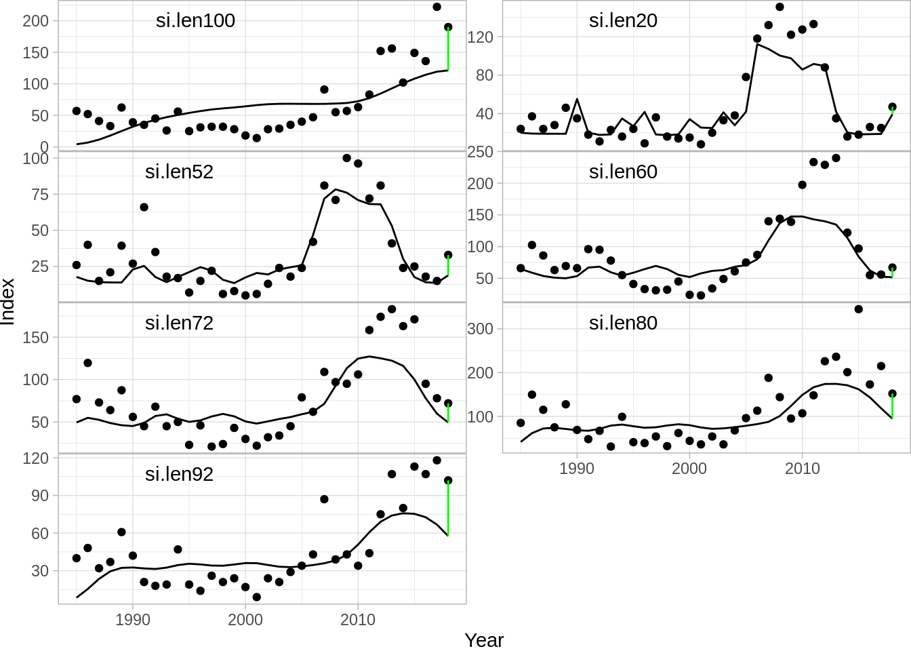

To produce a likelihood summary:

```r
plot(fit,data='summary')
```

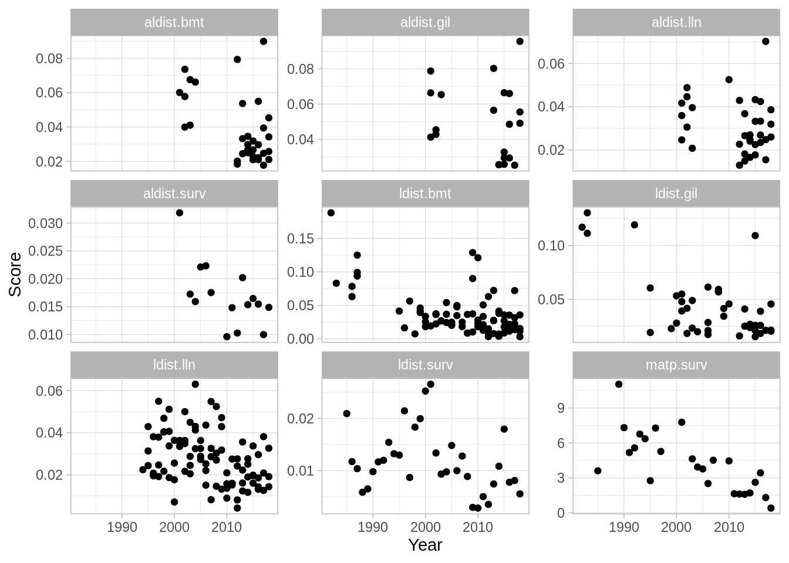

A weighted summary plot:

```r
plot(fit,data='summary',type = 'weighted')
```

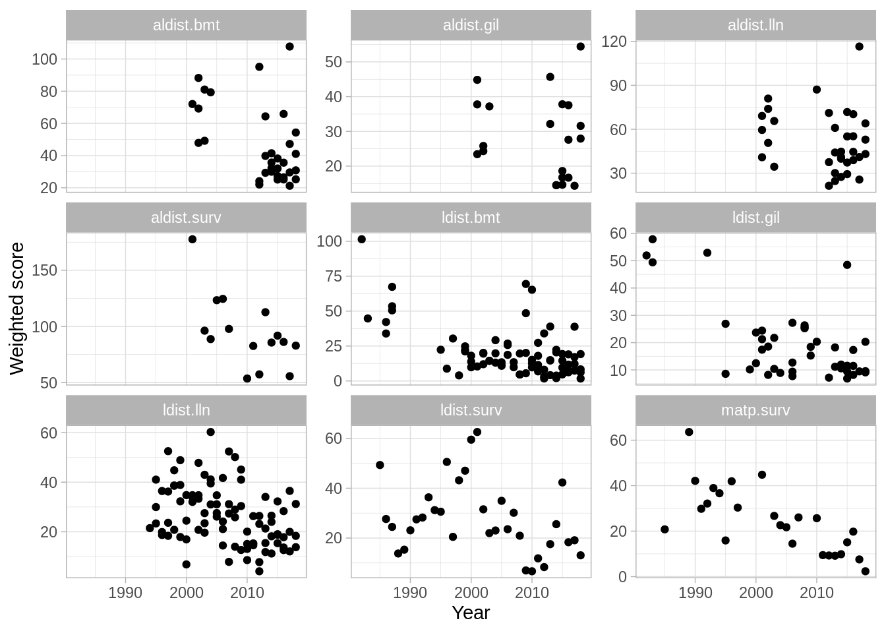

and a pie chart of likelihood components:

```r
plot(fit,data='summary',type='pie')
```

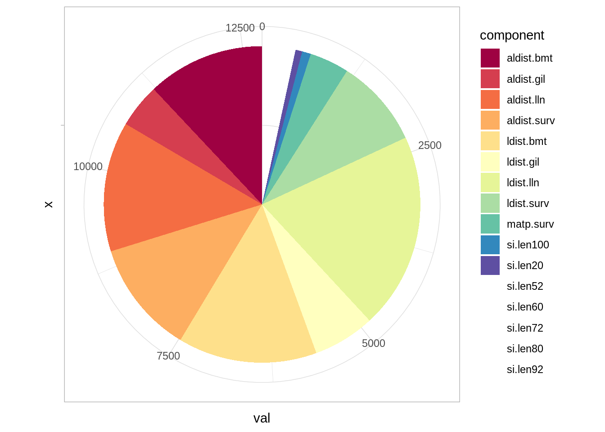

To plot the fit to catch proportions (either length or age) you simply do:

```r
tmp <- plot(fit,data = 'catchdist.fleets')
names(tmp)
```

```
## [1] "aldist.bmt"  "aldist.gil"  "aldist.lln"  "aldist.surv" "ldist.bmt"  
## [6] "ldist.gil"   "ldist.lln"   "ldist.surv"
```

and then plot them one by one:

```r
tmp$aldist.surv
```

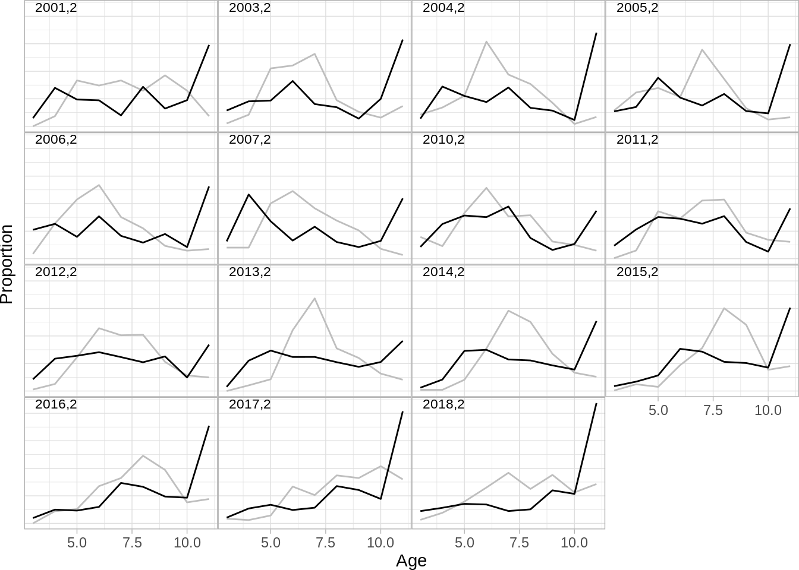

```r
tmp$ldist.surv
```

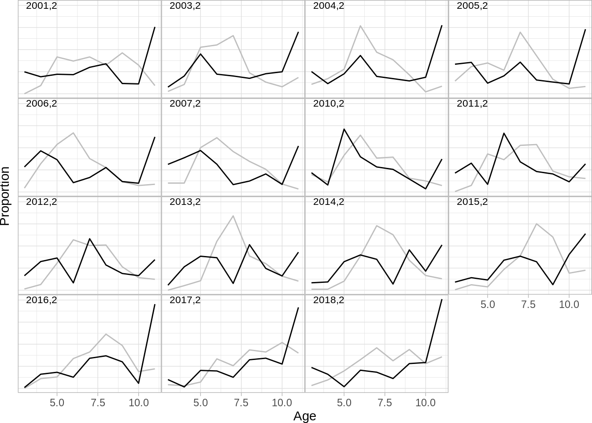


One can also produce bubble plots

```r
bubbles <- plot(fit,data = 'catchdist.fleets',type='bubble')
names(bubbles)
```

```
## [1] "ldist"  "aldist"
```

Age bubbles

```r
bubbles$aldist
```

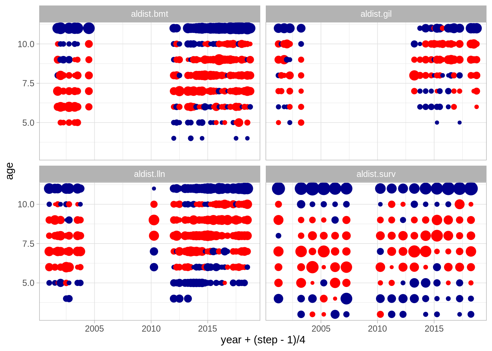

Length bubbles

```r
bubbles$ldist
```

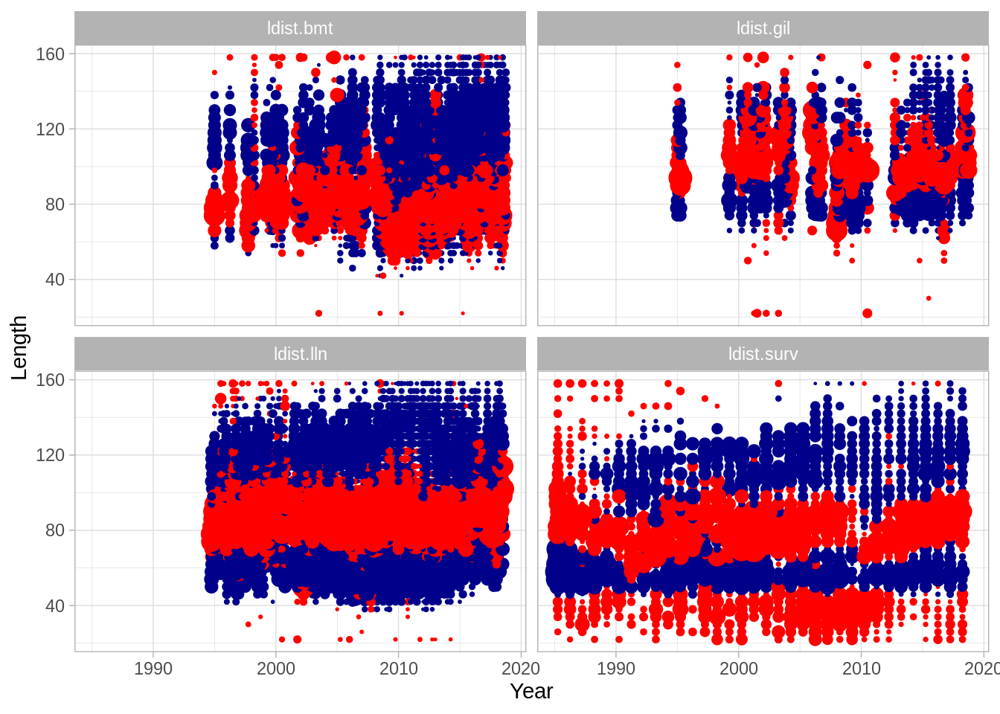

One can also illustrate the fit to growth in the model:

```r
grplot <- plot(fit,data = 'catchdist.fleets',type='growth')
names(grplot)
```

```
## [1] "aldist.bmt"  "aldist.gil"  "aldist.lln"  "aldist.surv"
```
Illstrate the fit to the autumn survey

```r
grplot$aldist.surv
```

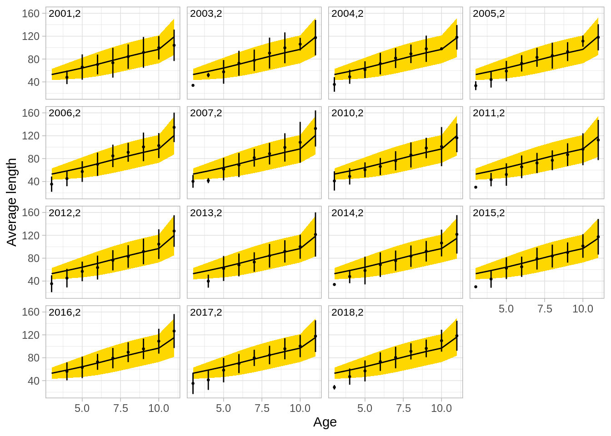

And the fit to maturity data:

```r
plot(fit,data='stockdist')
```

```
## $matp.surv
```

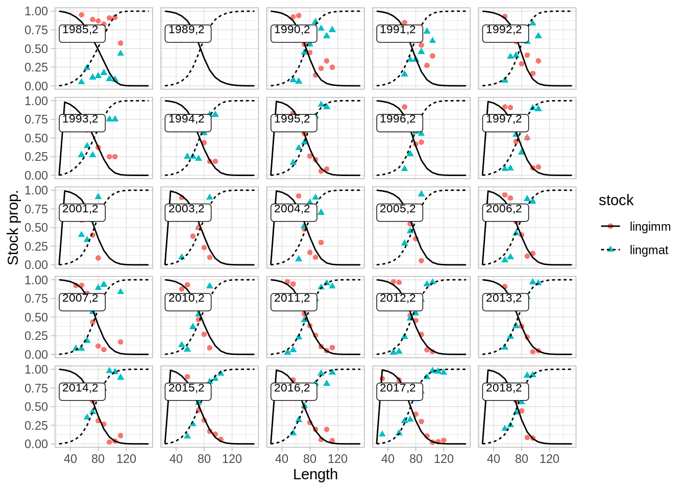

And selection by year and step

```r
plot(fit,data="suitability")
```

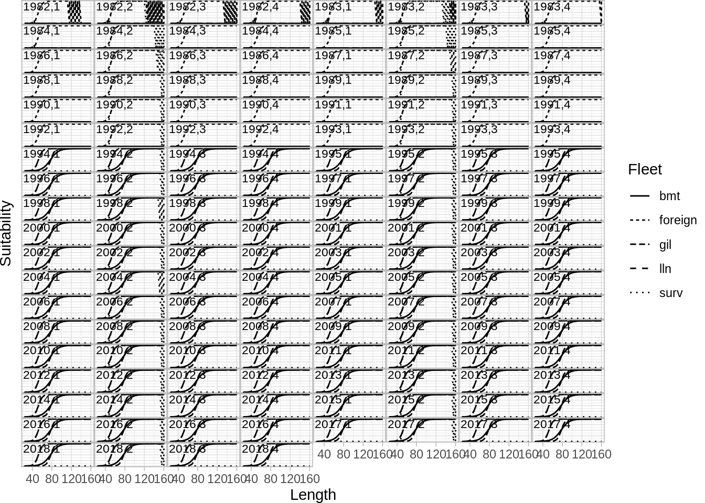

Age age compostion

```r
plot(fit,data='stock.std') + scale_fill_crayola()
```

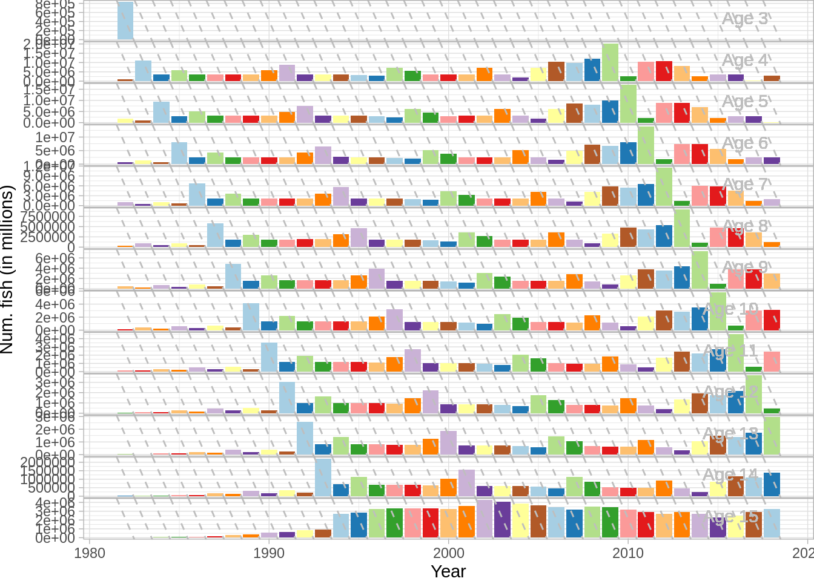


And the standard ICES plots

```r
plot(fit,data='res.by.year',type='total') + theme(legend.position = 'none') +
  plot(fit,data='res.by.year',type='F') + theme(legend.position = 'none') +
  plot(fit,data = 'res.by.year',type='catch') + theme(legend.position = 'none') +
  plot(fit, data='res.by.year',type='rec')
```

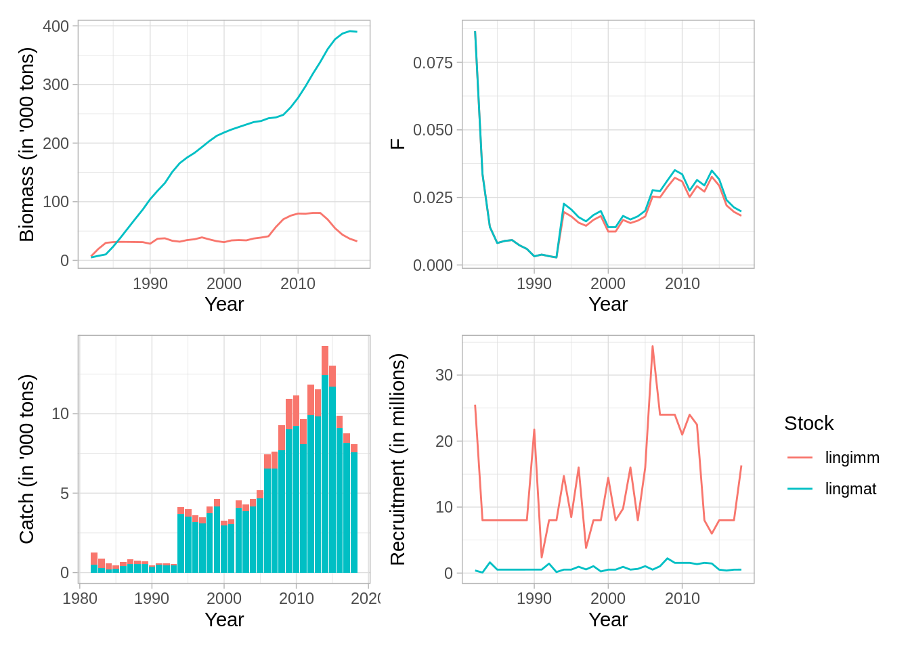

#### Exercise
* Try plotting the catchabilities on the normal scale (exponentiated, not log as given) across ages for each survey. What shape are they when plotted?
* What information is stored under fit$SS?
* Try changing the grouping structure above to one that makes more sense to you. Do model results fit any better?


```r
fit$sidat %>% 
  select(lower, intercept) %>% 
  distinct() %>% 
  mutate(catchability = exp(intercept)) %>% 
  ggplot(aes(x = lower, y = catchability)) + 
  geom_line()

fit$SS
```


