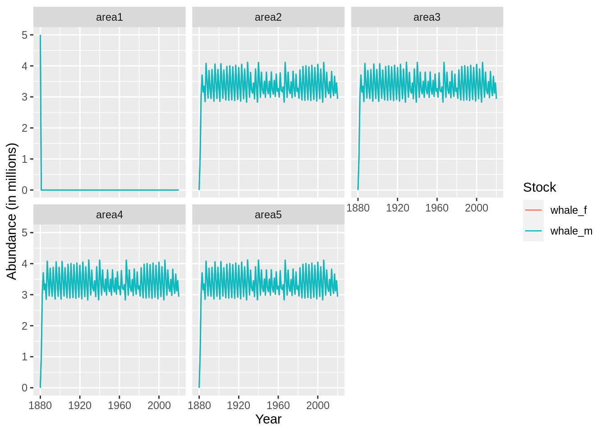
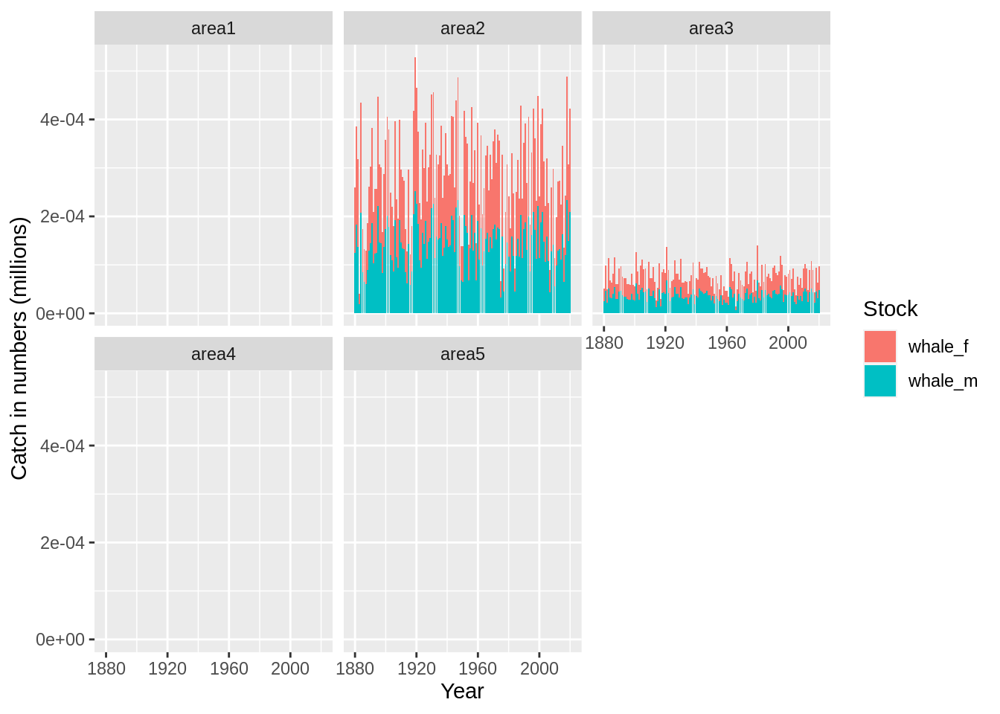
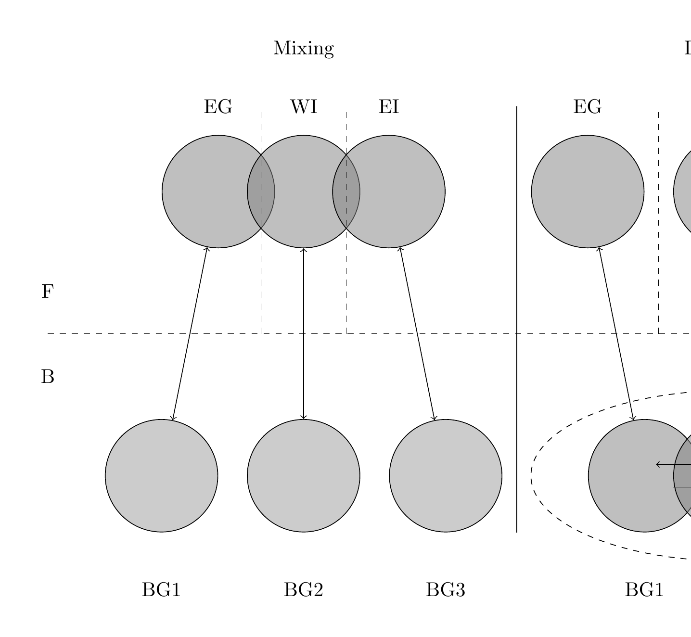

# Marine mammals

Marine mammals, like fish populations, can be modelled using the Gadget framework, although some caveats in the population population dynamics need to be considered. These include:

* Slower reproduction rate
* Growth in size typically reaches a plateau early compared when whaling occurs. 
* Longer lifespans
* Less data
* ...

## Setting up a model for a hypothetical whale stock

As usual we will start by setting up a Gadget model directory:

```r
gd <- gadget.variant.dir('whale-model')
```

and typically we are working with a longer time horizon for whales:


```r
schedule <- 
  expand_grid(year = 1880:2020, step = 1:4) %>% 
  arrange(year)

gadgetfile('Modelfiles/time',
           file_type = 'time',
           components = list(list(firstyear = min(schedule$year),
                                  firststep=1,
                                  lastyear=max(schedule$year),
                                  laststep=4,
                                  notimesteps=c(4,3,3,3,3)))) %>% ## number of time steps and step length in months
  write.gadget.file(gd)
```

and they migrate between multiple jurisdictions so let's add areas to the model:


```r
gadgetfile('Modelfiles/area',
           file_type = 'area',
           components = list(list(areas = 1:5,
                                  size = rep(1,5),
                                  temperature = schedule %>% 
                                    expand(year,step, area = 1:5, temperature = 5) %>% 
                                    arrange(year,step,area)))) %>% 
  write.gadget.file(gd)
```

To mimic the population dynamics we need to split each stock into two stock components, males and females, and the size of the female population governs the amount of whales birthed into the stock. 


```r
lw.constants <- list(estimate=c(0.001, 3)) ## arbitrary lw coeffs
init.sigma <- list(ms=rep(50, 41))

whale_m <- 
  gadgetstock('whale_m',gd, missingOkay = TRUE) %>% 
  gadget_update('stock',
                livesonareas = 1:5,
                minage = 0,
                maxage = 40,
                minlength = 50,
                maxlength = 1000,
                dl = 50) %>% 
  gadget_update('iseaten', 1) %>% 
  #gadget_update('naturalmortality', sprintf("#%s.M.%s", .[[1]]$stockname, .[[1]]$minage:.[[1]]$maxage)) %>% 
  gadget_update('doesgrow', ## note to self the order of these parameters make difference
                growthparameters=c(linf='#whale_m.Linf', 
                                   k=to.gadget.formulae(quote(0.001*whale_m.k)),
                                   alpha = '#whale_m.walpha',
                                   beta = '#whale_m.wbeta'),
                maxlengthgroupgrowth = 2,
                beta = to.gadget.formulae(quote(10*whale.bbin)))


whale_f <- 
  gadgetstock('whale_f',gd, missingOkay = TRUE) %>% 
  gadget_update('stock',
                livesonareas = 1:5,
                minage = 0,
                maxage = 40,
                minlength = 50,
                maxlength = 1200,
                dl = 50) %>% 
  gadget_update('iseaten', 1) %>% 
  #gadget_update('naturalmortality', sprintf("#%s.M.%s", .[[1]]$stockname, .[[1]]$minage:.[[1]]$maxage)) %>% 
  gadget_update('doesgrow', ## note to self the order of these parameters make difference
                growthparameters=c(linf='#whale_f.Linf', 
                                   k=to.gadget.formulae(quote(0.001*whale_f.k)),
                                   alpha = '#whale_f.walpha',
                                   beta = '#whale_f.wbeta'),
                maxlengthgroupgrowth = 2,
                beta = to.gadget.formulae(quote(10*whale.bbin)))
```


The simulation will start with a virgin population, i.e. start at the carrying capacity of the stock. To start the stock simulation the equilibrium age distribution needs to be calculated. So assuming that all year classes in the equilibrium stock are equal in abundance the year when they are born, i.e. $N_{0t} = B_0$ then the equilibrium age distribution at the start of the simulations, assuming constant natural mortality, is: 

$$ N_{a0} = A_0 e^{-aM}$$ 
and then carrying capacity is then:

$$ K = \sum_a N_{a0} = \sum_a A_0 e^{-aM}$$ 
and note this is a geometric series the carrying capacity is: 
$$ K = A_0 \frac{1-e^{-aM}}{1-e^{-M}}$$
so we can then solve for $A_0$ and find 
$$A_0 = K\frac{1-e^{-M}}{1-e^{-aM}}$$
Writing this into initial abundance at age in so in the initial conditions we will specify the age factor to be $e^{-aM}$ and the area factor as $A_0$.

```r
whale_m <- 
  whale_m %>% 
  gadget_update('initialconditions',
                normalparam = tibble(age = .[[1]]$minage:.[[1]]$maxage,
                                     area = 1,
                                     age.factor = parse(text=sprintf('exp(-1*(whale_m.M+whale_m_init.F)*%1$s)',age)) %>% 
                                       purrr::map(to.gadget.formulae) %>% 
                                       unlist(),   
                                     area.factor = to.gadget.formulae(quote(prop_m*whale_k*(1-exp(-whale_m.M))/(1-exp(-40*whale_m.M)))),
                                     mean = von_b_formula(age,linf='whale_m.Linf',k='whale_m.k',recl='whale_m.recl'),
                                     stddev = init.sigma$ms[age+1],
                                     alpha = '#whale_m.walpha',
                                     beta = '#whale_m.wbeta') %>% 
                  bind_rows(expand_grid(age = 0:40,area=2:5,age.factor='0',area.factor='0') %>% 
                              mutate(mean = von_b_formula(age,linf='whale_m.Linf',k='whale_m.k',recl='whale_m.recl'),
                                     stddev = init.sigma$ms[age+1],
                                     alpha = '#whale_m.walpha',
                                     beta = '#whale_m.wbeta'))) %>% 
  gadget_update('refweight',
                data=tibble(length=seq(.[[1]]$minlength,.[[1]]$maxlength,.[[1]]$dl),
                            mean=lw.constants$estimate[1]*length^lw.constants$estimate[2]))
whale_f <- 
  whale_f %>% 
  gadget_update('initialconditions',
                normalparam = tibble(age = .[[1]]$minage:.[[1]]$maxage,
                                     area = 1,
                                     age.factor = parse(text=sprintf('exp(-1*(whale_f.M+whale_f_init.F)*%1$s)',age)) %>% 
                                       purrr::map(to.gadget.formulae) %>% 
                                       unlist(),   
                                     area.factor = to.gadget.formulae(quote((1-prop_m)*whale_k*(1-exp(-whale_f.M))/(1-exp(-40*whale_f.M)))),
                                     mean = von_b_formula(age,linf='whale_f.Linf',k='whale_f.k',recl='whale_f.recl'),
                                     stddev = init.sigma$ms[age+1],
                                     alpha = '#whale_f.walpha',
                                     beta = '#whale_f.wbeta') %>% 
                  bind_rows(expand_grid(age = 0:40,area=2:5,age.factor='0',area.factor='0') %>% 
                              mutate(mean = von_b_formula(age,linf='whale_f.Linf',k='whale_f.k',recl='whale_f.recl'),
                                     stddev = init.sigma$ms[age+1],
                                     alpha = '#whale_f.walpha',
                                     beta = '#whale_f.wbeta'))) %>% 
  gadget_update('refweight',
                data=tibble(length=seq(.[[1]]$minlength,.[[1]]$maxlength,.[[1]]$dl),
                            mean=lw.constants$estimate[1]*length^lw.constants$estimate[2]))
```

This sets up two stock, male and female part of the stocks. Two important parts remain in the population dynamics to capture what is needed, migration and births. Let's start with the birth function. Only females give birth so the birth process only applies to that stock. The birth function used for this examples is 


```r
whale_f <- 
  whale_f %>% 
  gadget_update("doesspawn",
                spawnsteps = 1,
                spawnareas = 1,
                firstspawnyear = 1881,
                spawnstocksandratios = list(stock1 = "whale_f", ratio1 = 0.5, stock2 = 'whale_m', ratio2 = 0.5),
                proportionfunction = list(sel_func = 'constant', alpha = 1),
                mortalityfunction = list(sel_func = 'constant', alpha = 0),
                weightlossfunction = list(sel_func = 'constant', alpha = 0),
                recruitment = list(spawn_function = 'baleen', 
                                   num_births = '#whale_num_births', 
                                   resil_a = '#whale_resil.a',
                                   ## everything is in multiples of 1e4
                                   K = to.gadget.formulae(quote(whale_k*1e4)),  
                                   z = '#whale_z'), 
                stockparameters = list(mean = '#whale_f.recl',
                                       stddev = '#whale_f.recsd',
                                       alpha = '#whale_f.walpha',
                                       beta = '#whale_f.wbeta'))
```

Migratio: area 1 is a spawning area, areas 2 to 5 are feeding areas.


```r
whale_f <-
  whale_f %>% 
  gadget_update('doesmigrate',
                yearstepfile = 'Modelfiles/migrationtime',
                defineratios = 'Modelfiles/migration') %>% 
  write.gadget.file(gd)


whale_m <- 
  whale_m %>% 
  gadget_update('doesmigrate',
                yearstepfile = 'Modelfiles/migrationtime',
                defineratios = 'Modelfiles/migration') %>% 
  write.gadget.file(gd)
```


Let's define the migration matricies from spaning to feeding areas:


```r
feeding_migration <- 
  tibble(from = 1, to = 2:5, prop = sprintf('#feed_area_prop.%s',to))

spawn_migration <- 
  tibble(from = 2:5, to = 1, prop = 1)

no_migration <- ""

gadgetfile('Modelfiles/migration',
           components = list(migrationmatrix = list(
             name = 'feeding',
             feeding_migration %>% unite(tmp,from:prop,sep = " ") %>% .$tmp %>% paste(collapse = '\n\t')),
             migrationmatrix =list(
               name = 'spawning',
               spawn_migration %>% unite(tmp,from:prop,sep = " ") %>% .$tmp %>% paste(collapse = '\n\t')),
             migrationmatrix = list(name = 'stay_put', 
                                    no_migration)
           )) %>% 
  write.gadget.file(gd)
```
and the schedule when each matrix is used:

```r
gadgetfile('Modelfiles/migrationtime',
           file_type = 'data',
           components = list(schedule %>% 
                               #filter(step %in% c(1,2)) %>% ## migration occurs at the beginning of the timestep
                               mutate(defineratios = case_when(step == 2~'feeding',
                                                               step == 1~'spawning',
                                                               TRUE~'stay_put')))) %>% 
  write.gadget.file(gd)
```


Setting up fleets with random numbers

```r
whale_catch_a3 <- 
  schedule %>% 
  mutate(area = 3, 
         number = rbinom(n(),50,runif(n())),
         number = ifelse(step == 1, 0, number))
whale_catch_a3 <- 
  structure(whale_catch_a3,area = list(`1`= 1,`2`=2,`3`=3))

whale_catch_a2 <- 
  schedule %>% 
  mutate(area = 2, 
         number = rbinom(n(),200,runif(n())),
         number = ifelse(step == 1, 0, number))
whale_catch_a2 <- 
  structure(whale_catch_a2,area = list(`1`= 1,`2`=2,`3`=3))


gadgetfleet('Modelfiles/fleet',gd,missingOkay = TRUE) %>% 
  gadget_update('numberfleet',
                name = 'whale_fleet_a3',
                suitability = 
                  list(whale_m=list(type='function',
                                    suit_func = 'exponentiall50',
                                    alpha = "#whale_fleet.alpha", l50 = "#whale_fleet.l50"),
                       whale_f=list(type='function',
                                    suit_func = 'exponentiall50',
                                    alpha = "#whale_fleet.alpha", l50 = "#whale_fleet.l50")),
                data = whale_catch_a3) %>% 
    gadget_update('numberfleet',
                name = 'whale_fleet_a2',
                suitability = 
                  list(whale_m=list(type='function',
                                    suit_func = 'exponentiall50',
                                    alpha = "#whale_fleet.alpha", l50 = "#whale_fleet.l50"),
                       whale_f=list(type='function',
                                    suit_func = 'exponentiall50',
                                    alpha = "#whale_fleet.alpha", l50 = "#whale_fleet.l50")),
                data = whale_catch_a2) %>% 
  write.gadget.file(gd)
```

## Run Gadget and set initial parameters


```r
gadget_evaluate(gd, log = 'init.log')
```

```
## [1] "whale-model"
## attr(,"mainfile")
## [1] "main"
## attr(,"class")
## [1] "gadget.variant" "list"
```


```r
read.gadget.parameters(paste(gd,'params.out',sep='/')) %>% 
  init_guess('_f.Linf',1100,lower = 800, upper = 1400, optimise = 1) %>% 
  init_guess('_m.Linf',900,lower = 800, upper = 1400, optimise = 1) %>% 
  init_guess('\\.k$',180,lower = 150, upper = 300, optimise = 1) %>% 
  init_guess('_k$',1000,lower = 5, upper = 3000, optimise = 1) %>% 
  init_guess('\\.bbin',180,lower = 150, upper = 300, optimise = 1) %>% 
  init_guess('prop_m',0.5,lower = 0, upper = 1, optimise = 0) %>% 
  init_guess('init.F',0,lower = 0, upper = 1, optimise = 0) %>% 
  init_guess('recl',50,lower = 50, upper = 300, optimise = 1) %>% 
  init_guess('\\.k$',180,lower = 150, upper = 300, optimise = 1) %>% 
  init_guess('\\.walpha$',0.001,lower = 0, upper = 1, optimise = 0) %>% 
  init_guess('\\.wbeta',3,lower = 0, upper = 4, optimise = 0) %>% 
  init_guess('\\.recsd$',50,lower = 0, upper = 300, optimise = 1) %>% 
  init_guess('\\.M$',0.16,lower = 0, upper = 1, optimise = 0) %>% 
  init_guess('num_births',2,lower = 1, upper = 2, optimise = 1) %>% 
  init_guess('feed_area_prop',1/4,lower = 0, upper = 1, optimise = 0) %>%
  init_guess('resil.a',1.6,lower = 0, upper = 10, optimise = 0) %>% 
  init_guess('_z',2,lower = 0, upper = 3, optimise = 0) %>% 
  init_guess('fleet.alpha',0.08,lower = 0, upper = 1, optimise = 1) %>% 
  init_guess('fleet.l50',300,lower = 150, upper = 600, optimise = 1) %>% 
  write.gadget.parameters(paste(gd,'params.in',sep='/'))
```


```r
gadget_evaluate(gd,params.in = 'params.in', log = 'run.log')
```

```
## [1] "whale-model"
## attr(,"mainfile")
## [1] "main"
## attr(,"class")
## [1] "gadget.variant" "list"
```

```r
fit <- gadget.fit(gd = gd, wgts = NULL, params.file = 'params.in')
```

```
## [1] "Reading input data"
## [1] "Running Gadget"
## [1] "Reading output files"
## [1] "Gathering results"
## [1] "Merging input and output"
```

```r
plot(fit, data= 'res.by.year', type = 'num.total') + facet_wrap(~area)
```



```r
plot(fit, data= 'res.by.year', type = 'num.catch') + facet_wrap(~area)
```



## More complicated stock structures



