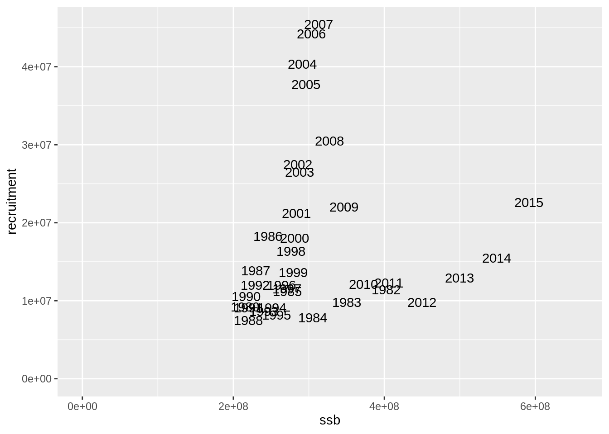
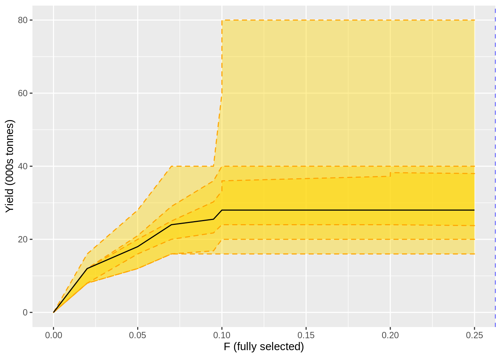
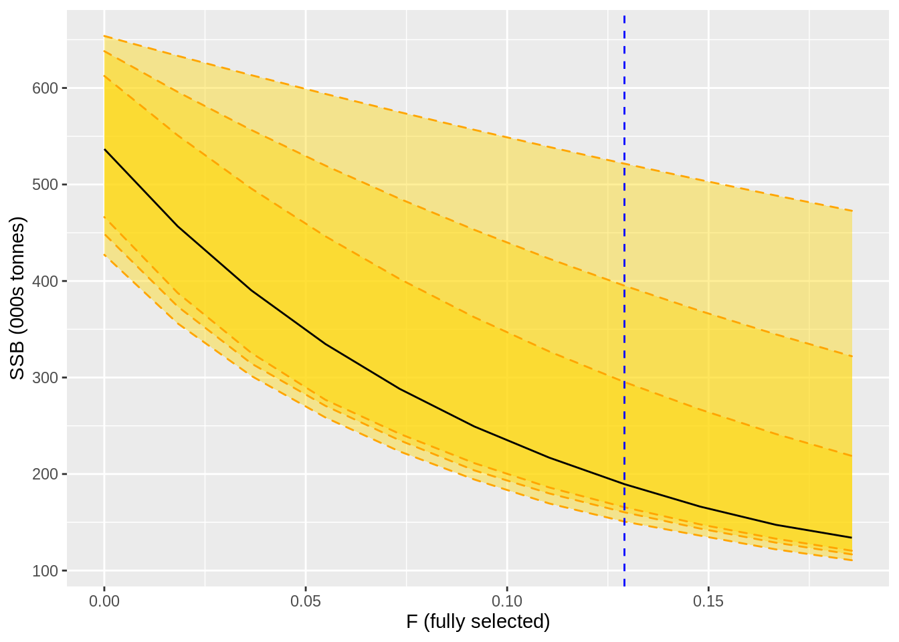
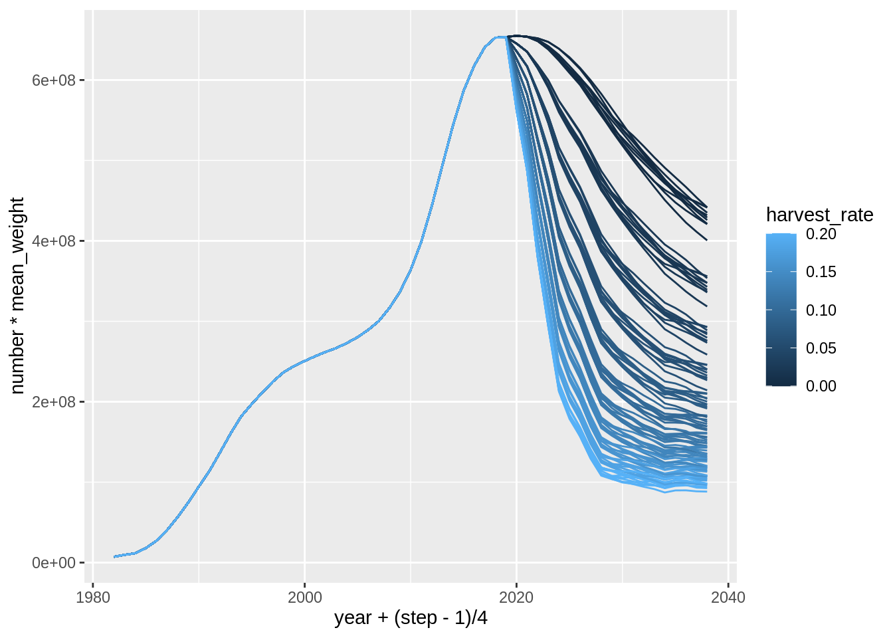
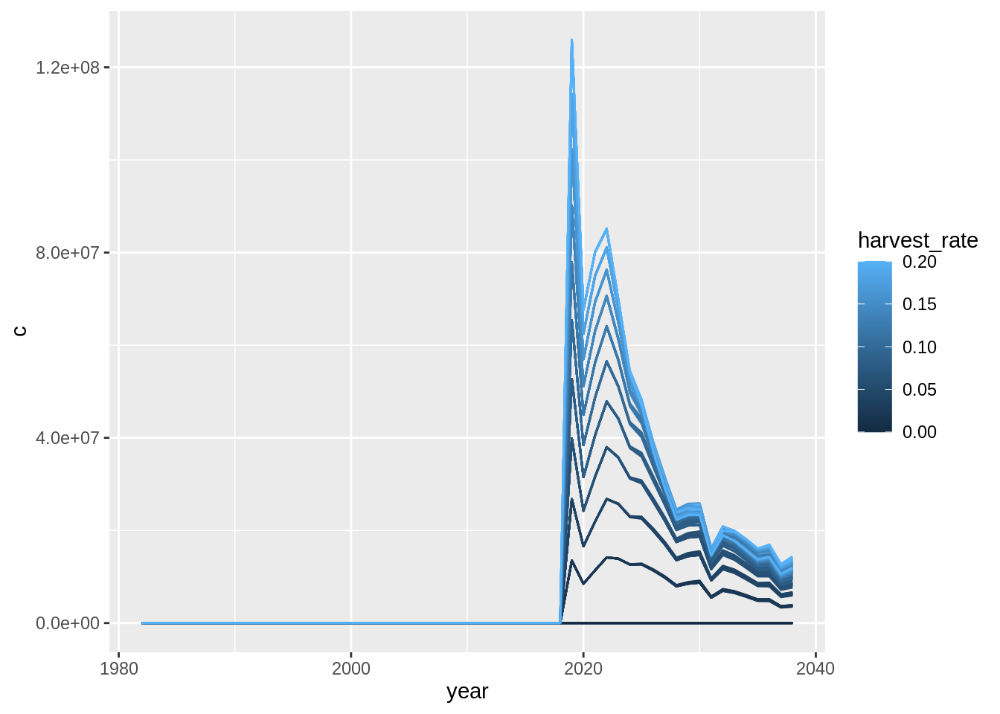
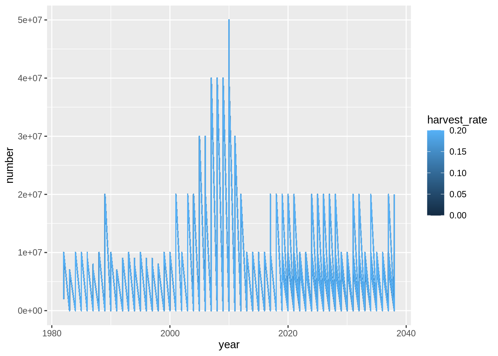

# Projections using Rgadget

Creating Gadget projections can be as simple as modifying the appropriate time and data files to create a model that runs over a longer time period. However, Rgadget is also comes with a series of projection functions that are handy for ensuring internal consistency of model files and includes a series of features that are often useful to the stock assessment modeler. For example, it simplifies the process for adding various error sources and harvest control rules for testing via stochastic simulation in a management strategy evaluation framework. 

## Example based on the ling assessment

As usual we will start by setting up a Gadget model directory and use ling as an example:

```r
#assuming you are beginning in a fresh session; this information should be in an 
#initialization script

base_dir <- 'ling_model'
vers <- c('01-base')
gd <- gadget.variant.dir(sprintf(paste0("%s/",vers),base_dir))
fit <- gadget.fit(gd = gd, wgts = NULL, params.file = 'params.forsim')
```

```
## Warning in if (class(tmp) != "list") {: the condition has length > 1 and only
## the first element will be used

## Warning in if (class(tmp) != "list") {: the condition has length > 1 and only
## the first element will be used
```

```
## [1] "Reading input data"
## [1] "Running Gadget"
## [1] "Reading output files"
## [1] "Gathering results"
## [1] "Merging input and output"
```

Projections are based on a series of functions that work together to produce a model with an extended time series and other modifications. These functions are under development, so may change in significant ways in the future. If you plan to use them, please make sure Rgadget is kept up to date. 

The general design of the functions sets up a procedure that:

1. sets the length of time of projections and directory where projection files will be stored using `gadget_project_time`.
2. indicates the template stocks on which stock biological parameterisations will be based in projections in `gadget_project_stocks`. Using the original as a template rather than directly in simulations allows more flexibility in allowing for novel biological scenarios to be explored without disturbing the original model construct. Note that `gadget_project_stocks` is only built to project the immature and mature portions of the stock. In a multi-species model, one would use multiple calls to `gadget_project_stocks` for each species.
3. indicates the template fleets on which fleet parameterisations will be based in projections using `gadget_project_fleet`. A single call to this function is used for each fleet. In management strategy evaluation, it is often the case that the projected fleet may need to respond to a harvest control rule or other have other modifications to its fishing behavior (e.g., input or output regulations, split effort / quota among fleets). Therefore this function has several built in features that aid with these implementations, but is often under development to improve functionality.
4. uses `gadget_evaluate` to set up a projection parameter file. ('params.pre' below) with all the same parameterisations as the template parameterisation file from the original model ('WGTS/params.final'). Note that the resulting 'params.pre' parameter file is in a 'wide' format that is understood by Gadget (switch names in one row, values in another row), which is more efficient in a framework where several simulations will be run.
5. modifies the 'params.pre' file by adding a recruitment series. There are currently a few different options for generating a recruitment series, including setting a constant value, using a block bootstrap re-sampling method, or generating a series from an auto-regressive time series model (lag 1). Creating replicates of different recruitment series is also possible at this point.
6. modifies the 'params.pre' file by adding reference points used to control fishing behavior via `gadget_project_ref_points`. Reference points are then used by processes controlled by `gadget_project_fleet`.
7. modifies the 'params.pre' file via `gadget_project_advice` by setting 2 important components of the management process: harvest levels and errors around those harvest levels (advice/assessment error). It needs to be applied once by fleet, like `gadget_project_fleet`. Both components are added to the params file, or modify parameter values for parameters that were created during fleet definitions in `project_gadget_fleet`. The arguments `advice_cv` and `advice_rho` define a lag 1 auto-regressive model from which a series of errors are randomly drawn. It is also possible to add replication at this stage (and therefore several rows of parameter values). However, note that this replication does not extend replication generated by recruitment, but instead applies replication across recruitment replicates.
8. creates printer files that define output succinctly via `gadget_project_output`. This function was specifically created for output useful in a management strategy evaluation of harvest controls, and controls what files are available to be read by the later `read.printfiles` function call, so may need to be custom-built for other purposes.
9. creates final simulation output via `gadget_evaluate`, where the final 'params.pre' file is inputted and model file output printed according to printer file specifications. The log file argument is optional and should only be used during debugging - be careful to remove it during runs involving many simulations or it may slow down processing.


Functions are joined via piping, but the only information being passed from function to function is a gadget variant directory (modified slightly from the user-defined directory inputted to `gadget_project_time`. All function calls after the final `gadget_evaluate` are examples of file and data management - reading in the outputted printer files, organise and labelling data (similar to what `gadget.fit` does), and storing under 'res' object.


```r
fit$res.by.year %>% 
  filter(stock == 'lingmat') %>% 
  select(year, ssb = total.biomass) %>% 
  left_join(fit$res.by.year %>% 
              filter(stock == 'lingimm') %>% 
              select(year, recruitment) %>% 
              mutate(year = year - 3)) %>% 
  ggplot(aes(ssb, recruitment, label = year)) + geom_text() +
  expand_limits(y=0, x=0)
```

```
## Joining, by = "year"
```

```
## Warning: Removed 3 rows containing missing values (geom_text).
```




```r
btrigger <- 6 ## break point for the harvest control rule
blim <- 4 ## break point for the hockey stick recruitment
hrs <- seq(0, 0.2, 0.02)
nreps <- 10
ny <-20
# vd <-  getwd() %>%   #useful for having all operations done in a temporary directory
#   stringr::str_count("/") %>% 
#   rep("../", .) %>% 
#   paste(collapse = "") %>%
#   paste(tempdir(),"_1", sep = "") 
vd <- 'TEST'

      res <-
        gadget_project_time(gd,
                            num_years = ny, 
                            variant_dir = vd) %>%
        gadget_project_stocks(imm.file = 'lingimm',mat.file = 'lingmat') %>%
        # gadget_project_fleet(pre_fleet = 'lln',
        #                      fleet_type = 'quotafleet',
        #                      quotafunction = 'ices',
        #                      biomasslevel = list(b0=0,b1=btrigger*1e6),
        #                      quotalevel = list(q0=0,q1=1,q2=1),
        #                      selectstocks = 'lingmat',
        #                      pre_proportion = 0.5
        # ) %>%
        # gadget_project_fleet(pre_fleet = 'bmt',
        #                      fleet_type = 'quotafleet',
        #                      quotafunction = 'ices',
        #                      biomasslevel = list(b0=0,b1=btrigger*1e6),
        #                      quotalevel = list(q0=0,q1=1,q2=1),
        #                      selectstocks = 'lingmat',
        #                      pre_proportion = 0.3
        # ) %>%
        # gadget_project_fleet(pre_fleet = 'gil',
        #                      fleet_type = 'quotafleet',
        #                      quotafunction = 'ices',
        #                      biomasslevel = list(b0=0,b1=btrigger*1e6),
        #                      quotalevel = list(q0=0,q1=1,q2=1),
        #                      selectstocks = 'lingmat',
        #                      pre_proportion = 0.5
        # ) %>%
        gadget_project_fleet(pre_fleet = 'lln', pre_proportion = 0.5, common_mult = 'ling_hr.pre') %>%
        gadget_project_fleet(pre_fleet = 'bmt', pre_proportion = 0.3, common_mult = 'ling_hr.pre') %>%
        gadget_project_fleet(pre_fleet = 'gil', pre_proportion = 0.2, common_mult = 'ling_hr.pre') %>%
        gadget_evaluate(params.out = paste(vd, 'params.pre',sep='/'),
                        params.in = 'params.forsim', log = 'TEST/log') %>%
        gadget_project_recruitment(stock = 'lingimm',
                                   recruitment = fit$stock.recruitment %>%
                                     filter(stock == 'lingimm', year %in% 1982:2000), 
                                   method = "bootstrap",
                                   params.file = paste(attr(.,'variant_dir'),'params.pre',sep='/'),
                                   n_replicates = nreps) %>% 
        gadget_project_ref_points(ref_points = tibble(lingmat.blim = blim*1e6,
                                                      lingmat.walpha = 2.2756744e-06,
                                                      lingmat.wbeta = 3),
                                  params.file = paste(attr(.,'variant_dir'),'params.pre',sep='/')) %>%
        gadget_project_advice(pre_fleet = 'ling_hr',
                              harvest_rate = hrs,
                              params.file = paste(attr(.,'variant_dir'),'params.pre',sep='/'),
                              n_replicates = nreps,
                              advice_cv = 0.2, 
                              post_fix = 'pre') %>%
        gadget_project_output(pre_fleets = c('bmt', 'lln', 'gil'), imm.file = 'lingimm',mat.file = 'lingmat') %>%
        gadget_evaluate(params.in = paste(attr(.,'variant_dir'),'params.pre',sep='/'), params.out = 'params.out', log = paste(vd,'log.test',sep='/')) %>%
        {read.printfiles(paste(.,attr(.,'variant_dir'),'out',sep='/'))} %>%
        purrr::map(mutate, trial=cut(1:length(year),c(0,which(diff(year)<0),1e9),labels = FALSE)) %>%
        set_names(c("catch.F","catch.lw",'imm.rec','mat.ssb')) %>%
        purrr::map(left_join,tibble(trial=1:(length(hrs)*nreps),
                                    harvest_rate = rep(hrs,nreps)
                                    )
                   )
```

```
## 
## ── Column specification ────────────────────────────────────────────────────────
## cols(
##   year = col_double(),
##   step = col_double(),
##   area = col_double()
## )
## 
## 
## ── Column specification ────────────────────────────────────────────────────────
## cols(
##   year = col_double(),
##   step = col_double(),
##   area = col_double()
## )
## 
## 
## ── Column specification ────────────────────────────────────────────────────────
## cols(
##   year = col_double(),
##   step = col_double(),
##   area = col_double()
## )
## 
## 
## ── Column specification ────────────────────────────────────────────────────────
## cols(
##   year = col_double(),
##   step = col_double(),
##   area = col_double()
## )
## 
## 
## ── Column specification ────────────────────────────────────────────────────────
## cols(
##   year = col_double(),
##   step = col_double(),
##   area = col_double()
## )
```

```
## Registered S3 method overwritten by 'quantmod':
##   method            from
##   as.zoo.data.frame zoo
```

```
## 
## ── Column specification ────────────────────────────────────────────────────────
## cols(
##   year = col_double(),
##   step = col_double(),
##   area = col_double()
## )
```

```
## Joining, by = "trial"
## Joining, by = "trial"
## Joining, by = "trial"
## Joining, by = "trial"
```

The above sequence can be used to implement error in recruitment and advice, but model error can also be implemented by first generating a series of input parameter files, each with a series of parameter values modified by some error. A call to one of these parameter files would replace 'WGTS/params.final' in the first `gadget_evaluate` function call. Running the above code in parallel, one for each of the generated parameter files with model error included, could then be accomplished for example via the `parallel` package.

Below are some examples of useful plots that can be generated from the above output.


```r
yield_curve <-
  res$catch.lw %>%
  filter(year>2020) %>%
  group_by(trial,harvest_rate,year) %>%
  summarise(c=sum(biomass_consumed)/1e6) %>%
  group_by(harvest_rate) %>%
  summarise(m=median(c),u=quantile(c,0.95),l=quantile(c,0.05), uu = quantile(c,0.85), ll = quantile(c,0.15), uuu = quantile(c,0.75), lll = quantile(c,0.25))
```

```
## `summarise()` regrouping output by 'trial', 'harvest_rate' (override with `.groups` argument)
```

```
## `summarise()` ungrouping output (override with `.groups` argument)
```

```r
ssb_curve <-
  res$mat.ssb %>%
  filter(year>2020) %>%
  group_by(trial,harvest_rate,year) %>%
  summarise(c=median(number*mean_weight)/1e6) %>%
  group_by(harvest_rate) %>%
  summarise(m=median(c),u=quantile(c,0.95),l=quantile(c,0.05), uu = quantile(c,0.85), ll = quantile(c,0.15), uuu = quantile(c,0.75), lll = quantile(c,0.25))
```

```
## `summarise()` regrouping output by 'trial', 'harvest_rate' (override with `.groups` argument)
## `summarise()` ungrouping output (override with `.groups` argument)
```

```r
ssb_res_05 <-
  res$mat.ssb %>%
  filter(year>2020) %>%
  group_by(trial,harvest_rate,year) %>%
  summarise(percyrsdropped = sum(ifelse(number*mean_weight/1e6 < blim, 1, 0))/n(),
            ssb = median(number*mean_weight/1e6)) %>%
  group_by(harvest_rate) %>%
  summarise(pcrash=sum(ifelse(percyrsdropped>0.05, 1, 0))/n(),
            ssb05 = min(ssb*ifelse(percyrsdropped<0.05, 1, NA), na.rm = T)) 
```

```
## `summarise()` regrouping output by 'trial', 'harvest_rate' (override with `.groups` argument)
## `summarise()` ungrouping output (override with `.groups` argument)
```

```r
f.curve <-
  res$catch.F %>%
  filter(year>2020) %>%
  #group_by(year, step, area, length, trial, harvest_rate) %>%
  #summarise(mortality = mean(mortality)) %>%
  group_by(trial,harvest_rate,year) %>%
  summarise(c=median(mortality)) %>%
  group_by(harvest_rate) %>%
  summarise(m=median(c),u=quantile(c,0.95),l=quantile(c,0.05), uu = quantile(c,0.85), ll = quantile(c,0.15), uuu = quantile(c,0.75), lll = quantile(c,0.25))
```

```
## `summarise()` regrouping output by 'trial', 'harvest_rate' (override with `.groups` argument)
## `summarise()` ungrouping output (override with `.groups` argument)
```

```r
hr_msy <-
  yield_curve %>% filter(m==max(m)) %>% .$harvest_rate

f.msy <-
  f.curve %>%
  filter(harvest_rate == hr_msy) %>%
  .$m
```

```
## Warning in harvest_rate == hr_msy: longer object length is not a multiple of
## shorter object length
```

```r
hr_msy;f.msy
```

```
## [1] 0.10 0.12 0.14 0.16 0.18 0.20
```

```
## numeric(0)
```

```r
yield_curve
```

```
## # A tibble: 11 x 8
##    harvest_rate     m     u     l    uu    ll   uuu   lll
##           <dbl> <dbl> <dbl> <dbl> <dbl> <dbl> <dbl> <dbl>
##  1         0      0       0     0     0   0     0     0  
##  2         0.02  12      16     8    12   8    12     8  
##  3         0.04  18      28    12    21  12    20    16  
##  4         0.06  24      40    16    29  16    25    20  
##  5         0.08  25.5    40    16    36  16.8  30.2  21.8
##  6         0.1   28      60    16    40  20    33.2  24  
##  7         0.12  28      80    16    40  20    36    24  
##  8         0.14  28      80    16    40  20    37.2  24  
##  9         0.16  28      80    16    40  20    38    24  
## 10         0.18  28      80    16    40  20    38.2  24  
## 11         0.2   28      80    16    40  20    38    23.8
```


```r
yield_plot <-
  yield_curve %>%
  left_join(f.curve %>%
              select(harvest_rate,F=m)) %>%
  ggplot(aes(F,m)) +
  geom_ribbon(aes(ymin=l,ymax=u),fill = 'gold', alpha = 0.4, colour = 'orange', linetype = 2) +  
  geom_ribbon(aes(ymin=ll,ymax=uu),fill = 'gold', alpha = 0.4, colour = 'orange', linetype = 2) +  
  geom_ribbon(aes(ymin=lll,ymax=uuu),fill = 'gold', alpha = 0.4, colour = 'orange', linetype = 2) +  
  geom_line() +
  geom_vline(xintercept = min(c(f.msy)),lty = 2, col = 'blue') +
  xlab('F (fully selected)') + ylab('Yield (000s tonnes)') 
```

```
## Joining, by = "harvest_rate"
```

```
## Warning in min(c(f.msy)): no non-missing arguments to min; returning Inf
```

```r
ssb_plot <-
  ssb_curve %>%
  left_join(ssb_res_05) %>% 
  left_join(f.curve %>%
              select(harvest_rate,F=m)) %>%
  ggplot(aes(F,m)) +
  geom_ribbon(aes(ymin=l,ymax=u),fill = 'gold', alpha = 0.4, colour = 'orange', linetype = 2) +  
  geom_ribbon(aes(ymin=ll,ymax=uu),fill = 'gold', alpha = 0.4, colour = 'orange', linetype = 2) +  
  geom_ribbon(aes(ymin=lll,ymax=uuu),fill = 'gold', alpha = 0.4, colour = 'orange', linetype = 2) +  
  geom_line() +
  geom_vline(xintercept = min(c(f.msy)),lty = 2, col = 'blue') +
  xlab('F (fully selected)') + ylab('SSB (000s tonnes)')
```

```
## Joining, by = "harvest_rate"
## Joining, by = "harvest_rate"
```

```
## Warning in min(c(f.msy)): no non-missing arguments to min; returning Inf
```

```r
yield_plot
```



```r
ssb_plot
```




```r
res$mat.ssb %>% 
  ggplot(aes(year + (step -1)/4, number*mean_weight,
             col = harvest_rate,
             group = interaction(harvest_rate, trial))) + 
  geom_line()
```



```r
res$catch.lw %>% 
  group_by(year,area,trial,harvest_rate) %>% 
  summarise(c = sum(biomass_consumed)) %>% 
  ggplot(aes(year, c,
             col = harvest_rate,
             group = interaction(harvest_rate, trial))) + 
  geom_line()
```

```
## `summarise()` regrouping output by 'year', 'area', 'trial' (override with `.groups` argument)
```



```r
res$imm.rec %>% 
  ggplot(aes(year, number,
             col = harvest_rate,
             group = interaction(harvest_rate, trial))) + 
  geom_line()
```




```r
btrigger <- 6
blim <- 4
hrs <- seq(0, 0.2, 0.02)
nreps <- 10
ny <-20
# vd <-  getwd() %>%   #useful for having all operations done in a temporary directory
#   stringr::str_count("/") %>% 
#   rep("../", .) %>% 
#   paste(collapse = "") %>%
#   paste(tempdir(),"_1", sep = "") 
vd <- 'TEST'

      res <-
        gadget_project_time(num_years = ny, 
                            variant_dir = vd) %>%
        gadget_project_stocks(imm.file = 'lingimm',mat.file = 'lingmat') %>%
        # gadget_project_fleet(pre_fleet = 'lln',
        #                      fleet_type = 'quotafleet',
        #                      quotafunction = 'ices',
        #                      biomasslevel = list(b0=0,b1=btrigger*1e6),
        #                      quotalevel = list(q0=0,q1=1,q2=1),
        #                      selectstocks = 'lingmat',
        #                      pre_proportion = 0.5
        # ) %>%
        # gadget_project_fleet(pre_fleet = 'bmt',
        #                      fleet_type = 'quotafleet',
        #                      quotafunction = 'ices',
        #                      biomasslevel = list(b0=0,b1=btrigger*1e6),
        #                      quotalevel = list(q0=0,q1=1,q2=1),
        #                      selectstocks = 'lingmat',
        #                      pre_proportion = 0.3
        # ) %>%
        # gadget_project_fleet(pre_fleet = 'gil',
        #                      fleet_type = 'quotafleet',
        #                      quotafunction = 'ices',
        #                      biomasslevel = list(b0=0,b1=btrigger*1e6),
        #                      quotalevel = list(q0=0,q1=1,q2=1),
        #                      selectstocks = 'lingmat',
        #                      pre_proportion = 0.5
        # ) %>%
        gadget_project_fleet(pre_fleet = 'lln', pre_proportion = 0.5, common_mult = 'ling_hr') %>%
        gadget_project_fleet(pre_fleet = 'bmt', pre_proportion = 0.3, common_mult = 'ling_hr') %>%
        gadget_project_fleet(pre_fleet = 'gil', pre_proportion = 0.2, common_mult = 'ling_hr') %>%
        gadget_evaluate(params.out = 
                          paste(vd, 'params.pre',sep='/'),
                        params.in = 'WGTS/params.final') %>%
        gadget_project_recruitment(stock = 'lingimm',
                                   recruitment = fit$stock.recruitment %>%
                                     filter(stock == 'lingimm'), 
                                   method = "bootstrap",
                                   params.file = paste(attr(.,'variant_dir'),'params.pre',sep='/'),
                                   n_replicates = nreps) %>% 
        gadget_project_ref_points(ref_points = tibble(tuskmat.blim = blim*1e6),
                                 params.file = paste(attr(.,'variant_dir'),'params.pre',sep='/')) %>%
        gadget_project_advice(pre_fleet = 'ling_hr',
                              harvest_rate = hrs,
                              params.file = paste(attr(.,'variant_dir'),'params.pre',sep='/'),
                              n_replicates = nreps,
                              advice_cv = 0.2, 
                              seed = 3423) %>%
        gadget_project_output(pre_fleets = c('bmt', 'lln', 'gil'), imm.file = 'lingimm',mat.file = 'lingmat') %>%
        gadget_evaluate(params.in = paste(attr(.,'variant_dir'),'params.pre',sep='/'), params.out = 'params.out', log = paste(vd,'log.test',sep='/')) %>%
        {read.printfiles(paste(attr(.,'variant_dir'),'out',sep='/'))} %>%
        purrr::map(mutate, trial=cut(1:length(year),c(0,which(diff(year)<0),1e9),labels = FALSE)) %>%
        set_names(c("catch.F","catch.lw",'imm.rec','mat.ssb')) %>%
        purrr::map(left_join,tibble(trial=1:(length(hrs)*nreps),
                                    harvest_rate = rep(hrs,nreps)
                                    )
                   )
```
